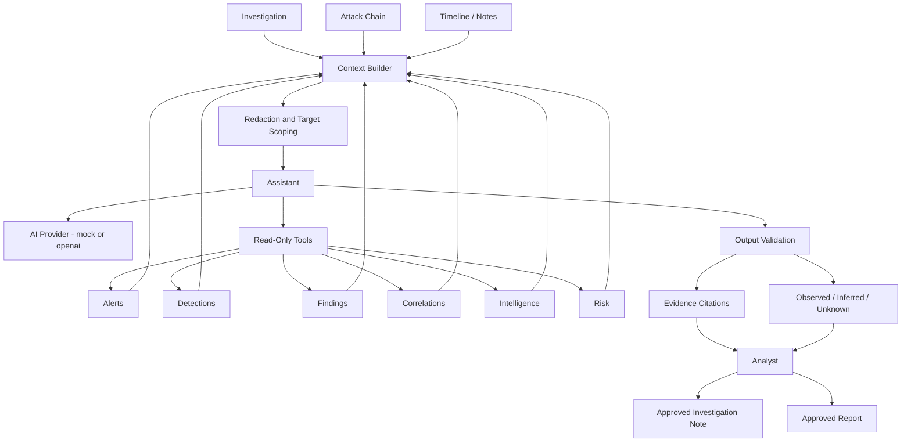

# AI Assistant Architecture

Phase 13 adds an evidence-grounded investigation copilot on top of Phase
1-12's own persisted data. It never duplicates the investigation, alert,
correlation, intelligence, or risk models — it reads them, through a
narrow set of read-only tools, and produces citation-validated, advisory
output for an analyst to review.

## Layering

```
internal/ai                    self-contained engine — no DB, no domain-package import
    providers/mock              offline, deterministic, zero-dependency
    providers/openai             OpenAI-compatible Chat Completions client
    tools/                      read-only Tool wrappers over a DataSource interface

internal/domain/ai             persisted model (Session/Message/Request/Response/ToolCall)

internal/repository/ai         Postgres persistence for the domain model

internal/service/ai            the bridge: builds internal/ai.Context from
                                Phase 2/7/8/9/10/11/12's own repositories,
                                runs the engine, persists the result
```

This is the same "engine is self-contained, the service layer bridges it
to the domain model and the database" split every prior phase's engine
package (`internal/correlation`, `internal/ruleengine`, `internal/
investigation`) already follows. `internal/ai` has zero dependency on
`internal/domain/ai` or any repository package — it knows only its own
vocabulary (`Fact`, `Context`, `TaskType`, `Confidence`, `Provider`,
`Tool`), so it can be unit-tested and reasoned about without a database.

## Provider abstraction

```go
type Provider interface {
    Name() string
    Generate(ctx context.Context, req Request) (ProviderResponse, error)
}
```

A `ProviderRegistry` holds every configured provider by name. Two ship
today:

- **mock** (`internal/ai/providers/mock`) — no external dependency;
  narrates the same deterministic, already-citation-safe prompt content
  it was given. This is the default, and what the entire test suite runs
  against (phase13.md §59).
- **openai** (`internal/ai/providers/openai`) — a generic OpenAI-
  compatible Chat Completions client (works against OpenAI itself, an
  Azure-compatible proxy, or a self-hosted vLLM/Ollama/llama.cpp server)
  — no vendor is hard-coded.

`internal/ai.WithRetries` wraps any `Provider` with bounded, deterministic
retries (fixed backoff, no jitter) — `internal/service/ai.Service` always
resolves a provider through this wrapper.

## Context builder

`internal/service/ai/context.go`'s `Build*Context` functions (Investigation/
Alert/Detection/Correlation/Target) are the only place a `Context` is
assembled from real data:

1. Fetch the anchor row (an investigation, alert, detection match,
   correlation) via its owning phase's repository.
2. Resolve every attached/referenced entity (evidence, timeline, notes,
   graph nodes/edges, chain/stages) through the same repositories —
   `internal/service/ai/facts.go`'s `*ToFact` functions convert each into
   an `ai.Fact`, always via `ai.RedactFact` as the final step.
3. `ai.Truncate` bounds the result deterministically (newest-first
   per-type, then overall) against `ai.Limits`; when anything is cut,
   `Context.Truncated`/`TruncationNote` record it, and `BuildPrompt`
   surfaces the exact sentence phase13.md §13 specifies.
4. `Context.Hash()` computes a normalized, order-independent hash for
   audit (`ai_requests.context_hash`) — see phase13.md §100.

## Tool system

`internal/ai.DataSource` is the one boundary a `Tool` is ever built
against — nine read-only methods (`GetInvestigation`, `GetAlert`, `Get
Detection`, `GetCorrelation`, `GetTimeline`, `GetFindings`, `GetAssets`,
`GetIntelligence`, `GetRisk`), each returning `[]ai.Fact`. `internal/
service/ai/datasource.go`'s `dataSource` type implements it against the
real repositories, enforcing `TargetID` scoping on every call. `ai.
Executor` is the only path a tool is ever invoked through — it enforces
the allowlist, a per-call timeout, `MaxResults`, and always audits (see
`docs/ai/safety.md`).

## Prompt architecture

`internal/ai/prompt.go`'s `BuildPrompt` renders two strings per task: a
fixed system preamble (trust-boundary rules, never shown to an analyst)
plus the task name and its `PromptVersion` (`<task>:v1`), and a user
prompt embedding every `Fact` inside an explicit `<data>` block. A
`Provider` never sees a raw `Context` — only these two rendered strings —
so a provider implementation structurally cannot bypass redaction or the
trust-boundary framing.

## Structured output and citations

`internal/ai/structured.go`'s `StructuredResult` (`Summary`, `Observed`,
`Inferred`, `Unknown`, `EvidenceGaps`, `NextSteps`, `Questions`,
`Citations`) is built **deterministically** from a `Context` by the pure
functions in `investigator.go`/`summarizer.go` — never by parsing a
provider's free-form text. This is what makes the pipeline testable and
provider-independent (phase13.md §39/§69): identical `Context` + the mock
provider always produces identical output, and a real provider's own
narration is validated against, and can always fall back to, this
grounded rendering.

`Assistant.Run` ties it together: build the structured facts → render the
prompt → call the provider → validate (`internal/ai/validation.go`) →
derive confidence → return an `ai.Result`.

## Validation and guardrails

See `docs/ai/safety.md` for the full policy. In one sentence: every
citation not present in the supplied `Context` is stripped, every
unsupported-claim phrase is rewritten to a hedged equivalent, every
attribution claim discards the entire narration in favor of the
deterministic fallback, and secrets are redacted twice (once when the
`Fact` was built, once again on the provider's own output).

## Sessions

An `ai.Session` (`internal/domain/ai`) scopes a bounded conversation to
one target and, usually, one investigation. `internal/service/ai/
sessions.go`'s `Chat` appends the analyst's question as a `user` message,
runs `ChatReply` against the session's own context, and appends the
assistant's (already-validated) answer as an `assistant` message — the
same `Request`/`Response` audit trail every other task produces.

## Privacy

Redaction happens before a `Fact` ever enters a `Context`, which is
before anything is ever sent to any provider — including a network
request to `openai`. See `docs/ai/safety.md`'s "Secret handling" section.

## Observability

`ai_responses` records `model`, `provider`, `prompt_version`, token
counts, and latency for every completed request (phase13.md §96/§98);
`ai_tool_calls` records the same for every tool invocation. No metrics
library (Prometheus or otherwise) exists anywhere in this platform yet —
structured `slog` logging at every failure point is this phase's
observability mechanism, the same adaptation Phase 11/12 already applied
to their own "metrics" sections.

## Architecture diagram



## Known adaptations

- No REST API exists in this codebase (only `/health`, `/ready`) —
  phase13.md's API sections are adapted to `ai-surface ai ...` CLI
  subcommands, the same adaptation every prior phase applied.
- No job/worker queue exists yet — AI requests (including report drafts)
  run synchronously, bounded by `ai.timeouts.request` and cancelable via
  context; see `internal/domain/ai`'s own package doc comment.
- No RBAC exists in this platform — `TargetID` scoping is the
  authorization boundary throughout, the same as every other phase.
- Rate limiting (`internal/service/ai/ratelimit.go`) is process-local, not
  cluster-wide — this platform has no shared cache/queue infrastructure
  in active use (Redis is verified at startup only).
