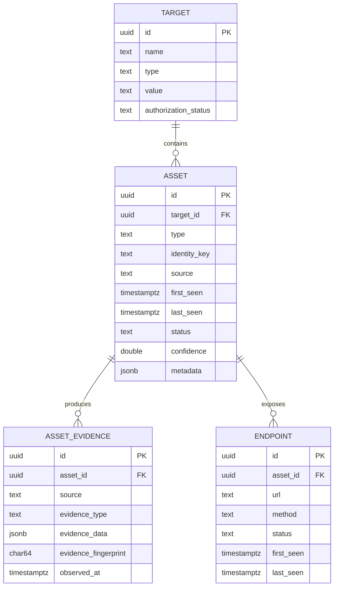

# Phase 2 Architecture: Asset Model & Persistence Engine

This document describes the canonical asset inventory built in Phase 2 —
the permanent data foundation future discovery, fingerprinting, probing,
correlation, and reporting subsystems read from and write to. It does not
describe those subsystems, which don't exist yet: Phase 2 performs no
network discovery of its own.

## Package map

```text
internal/
├── domain/
│   ├── validation/   shared structured validation-error type
│   ├── target/       Target entity + format validation
│   ├── asset/        Asset + Evidence entities, identity, redaction
│   └── endpoint/     Endpoint entity + URL normalization
│
├── repository/
│   ├── pagination/   cursor-based pagination shared by every List
│   ├── sqlerr/       pgx/PostgreSQL error -> internal/errors translation
│   ├── target/        Repository interface + PostgresRepository
│   ├── asset/          Repository + EvidenceRepository interfaces + impl
│   └── endpoint/        Repository interface + PostgresRepository
│
└── service/
    ├── target/   TargetService: validation, duplicate detection, the
    │              authorization-state boundary
    └── asset/    AssetService: validation, identity, redaction,
                   transactional "record an observation"

migrations/  000002_create_targets.sql .. 000005_create_endpoints.sql
```

The dependency direction is strict and one-way:

```text
Discovery source (future phase)
      │
      ▼
Service layer  (internal/service/*)
      │
      ▼
Repository interface  (internal/repository/*)
      │
      ▼
PostgreSQL implementation
```

A future discovery module calls `AssetService.RecordObservation` (or
`UpsertAsset`); it never calls `database.Exec` directly, and repository
packages never contain business rules — only persistence.

## Entity relationships



## Target

`internal/domain/target.Target` represents the authorized scope a scan may
operate against: a `Type` (`DOMAIN`, `HOST`, `IP`, `CIDR`, `URL`,
`REPOSITORY`, `CLOUD_ACCOUNT`) plus a `Value` that must be well-formed for
that type. `Target.Validate()` is a pure format check — regexes and
`net.ParseIP`/`net.ParseCIDR`/`url.Parse` — never a network request or DNS
lookup, so it's safe to call from anywhere, including future scanning
components deciding whether a target is even worth attempting.

### Authorization is never implicit

A row existing in `targets` is not permission to act against it.
`AuthorizationStatus` (`UNVERIFIED`, `AUTHORIZED`, `EXPIRED`, `REVOKED`)
starts `UNVERIFIED` on every `TargetService.Create` call and only ever
changes through the explicit `TargetService.UpdateAuthorizationStatus`
call. `Target.IsAuthorized()` returns true for exactly one state
(`AUTHORIZED`); every future phase that performs an active operation must
consult it (or `TargetService.IsAuthorized`) first. See `SECURITY.md`.

### Duplicate detection

`targets` has a unique index on `(type, value)`. `TargetService.Create`
checks `GetByValue` first and returns a `CategoryConflict` error on an
exact duplicate — this is deliberately simple (no fuzzy matching): the same
(type, value) pair is always the same real-world target.

## Asset

`internal/domain/asset.Asset` is the canonical record of anything
discovered within a target's scope. Fields that don't apply to every asset
type (`Hostname`, `IP`, `Port`, `Protocol`, `URL`, `Technology`,
`Provider`, `Model`, `Environment`) are `*string`/`*int` rather than
zero-valued — `nil` honestly means "unknown / not applicable" instead of
falsely claiming an empty hostname or port `0`. The same fields are
`INET`/`TEXT`/`INTEGER` nullable columns in PostgreSQL.

### Asset identity and deduplication

Two discovery modules observing the same real-world thing — DNS finding
`api.example.com`, certificate transparency finding the same hostname on a
TLS certificate — must not become two rows. `internal/domain/asset.Identity`
computes a deterministic natural key whose strategy depends on `Type`:

| Asset type(s)                                   | Identity is derived from                          |
| ------------------------------------------------ | -------------------------------------------------- |
| `HOST`, `DOMAIN`, `SUBDOMAIN`                     | normalized hostname                                 |
| `IP`                                              | canonical IP address                                |
| `PORT`, `SERVICE`                                 | normalized host + port + protocol                   |
| `HTTP_ENDPOINT`, `API_ENDPOINT`, `AI_ENDPOINT`     | scheme + normalized host + normalized port + path    |
| `REPOSITORY`, `CLOUD_RESOURCE`, `MODEL_ENDPOINT`   | URL, else hostname, else provider/model (first match)|

`Identity` never uses a display name and never uses mutable observed
content (a response body, a header value) — only the fields that define
*what the thing is*. `IdentityKey` is the SHA-256 hex digest of `Identity`,
stored in `assets.identity_key`; the database enforces uniqueness with
`UNIQUE (target_id, identity_key)`, so deduplication is scoped per target
(the same IP address as two different customers' targets is legitimately
two different assets).

### Upsert semantics

`AssetRepository.Upsert` is a single `INSERT ... ON CONFLICT (target_id,
identity_key) DO UPDATE` statement — not a `SELECT` followed by a
conditional `INSERT`, which would race under concurrent discovery workers
(see Concurrency below). On conflict:

- `first_seen` becomes `LEAST(existing, new)` and `last_seen` becomes
  `GREATEST(existing, new)` — not "first_seen is never touched": two
  concurrent callers observing the same identity can reach the database in
  either order, so the only way `first_seen` reliably ends up as the true
  earliest observation regardless of arrival order is to take the minimum
  on every upsert, the same way `last_seen` takes the maximum. For a
  strictly sequential series of observations this has the same effect as
  "never touched" (each new timestamp is later than the last), but it also
  gets the concurrent, out-of-order case right — see
  `TestAssetPersistence_ConcurrentUpsertSameIdentity`.
- `confidence` becomes `GREATEST(existing, new)` — a later, less-confident
  observation never downgrades an asset's confidence.
- optional fields (`hostname`, `ip`, `port`, `protocol`, `url`,
  `technology`, `provider`, `model`, `environment`,
  `organization_id`) fill in with `COALESCE(new, existing)` — a new
  observation can add information but never blanks out a field a previous
  observation already populated.
- `metadata` is shallow-merged with PostgreSQL's JSONB `||` operator (the
  new observation's keys win on conflict).
- `status` and `source` are **not** in the `DO UPDATE SET` clause at all —
  they never change via Upsert. See Status below.

### Status is always an explicit change

An asset is never marked `INACTIVE` just because one scan didn't observe
it again — that's an inference, not an observation, and scans are
inherently incomplete (a firewall rule, a network blip, rate limiting).
`Status` (`DISCOVERED`, `ACTIVE`, `INACTIVE`, `UNKNOWN`, `RETIRED`) changes
only through `AssetService.UpdateStatus` / `AssetRepository.UpdateStatus`,
a dedicated statement, never as a side effect of `Upsert`.

### Confidence

`asset.Confidence` is a `float64` constrained to `[0.0, 1.0]`
(`Confidence.Validate`, mirrored by the `assets_confidence_range` and
`asset_evidence_confidence_range` CHECK constraints). `Confidence.Level()`
buckets a score into `UNKNOWN` (`< 0.25`), `LOW` (`0.25-0.5`), `MEDIUM`
(`0.5-0.75`), `HIGH` (`0.75-1.0`), `CONFIRMED` (`1.0`) so every caller uses
the same thresholds instead of reimplementing them.

### Metadata and secret redaction

`Metadata` is arbitrary `JSONB` — response headers, TLS version, whatever a
discovery source wants to attach. `internal/domain/asset.SanitizeMetadata`
is the **mandatory** boundary between anything a source observed and
anything logged or persisted: it walks the metadata recursively (objects
and arrays) and replaces the value of any key matching a sensitive-key
fragment (`authorization`, `cookie`, `password`, `passwd`, `secret`,
`token`, `api_key`, `access_token`, `refresh_token`, `private_key`,
`credential`, case-insensitive substring match) with the literal string
`"[REDACTED]"`. `AssetService` and evidence recording call this before
anything reaches the repository layer — the original value is never
logged and never reaches PostgreSQL. The same rule is applied to endpoint
metadata and to `asset_evidence.evidence_data`.

Query strings get an analogous treatment one level earlier: URL
normalization (see Endpoint below) keeps only parameter *names*, never
values, since values commonly carry session tokens or API keys.

## Asset Evidence

`internal/domain/asset.Evidence` is a separate, **append-only** entity: the
concrete observation that justifies believing an asset exists (a DNS
answer, an HTTP response, a TLS certificate, ...). Evidence is never
updated or deleted by the application — a changed observation is always a
*new* row. This is what lets the platform show "why do we believe this
asset exists" as a full history rather than the single latest guess.

### Evidence deduplication

Without a dedup boundary, running the same scan daily would produce one
identical evidence row per day forever. `EvidenceFingerprint` is the
SHA-256 hex digest of the evidence data's canonical JSON encoding —
`encoding/json` always marshals Go maps with sorted keys, so the
fingerprint is stable regardless of map iteration order. Together with
`(asset_id, source, evidence_type)`, the fingerprint is the
`asset_evidence_dedup_unique` constraint's key; `CreateEvidence` inserts
with `ON CONFLICT (...) DO NOTHING` and, on conflict, fetches and returns
the existing row instead — identical evidence is recorded once, not once
per scan, while evidence that genuinely differs (even from the same source
and type) is always kept as its own row.

The fingerprint is always computed **after** `SanitizeMetadata` — a secret
value is never hashed into a stored fingerprint either.

## Endpoint

`internal/domain/endpoint.Endpoint` represents one HTTP method + URL
observed on an asset. `Method`/`Scheme`/`Host`/`Port`/`Path`/`QueryPattern`
are always the *normalized* form (see below) — never the raw, as-observed
URL — which is what makes `(asset_id, method, url)` a valid uniqueness
constraint for deduplication, the same `INSERT ... ON CONFLICT DO UPDATE`
pattern as assets: `first_seen`/`last_seen` take the min/max of the
existing and new values (see Asset's Upsert semantics above for why),
`metadata` is merged, and `content_type`/`status_code`/`response_hash`/
`query_pattern` update to the latest observation.

### URL normalization

`endpoint.Normalize` is a pure, deterministic string transformation — no
network request:

- scheme and host are lowercased;
- a missing path becomes `/`; the path is `path.Clean`-ed (resolving `.`
  and `..`, collapsing duplicate slashes);
- **trailing-slash policy**: the canonical path never ends in `/` unless
  it *is* `/` itself — `https://example.com/api` and
  `https://example.com/api/` normalize to the same identity;
- the fragment is discarded entirely (it never reaches the server and
  carries no identity information);
- the port resolves to an explicit value (the scheme's default if
  unspecified) and is always populated in `Normalized.Port`, but is
  omitted from the canonical URL string when it equals that default
  (`https://example.com`, not `https://example.com:443`);
- query parameter *names* (sorted, deduplicated, comma-joined) become
  `QueryPattern`; query parameter *values* are discarded — see the
  redaction discussion above.

## Repository architecture

Every repository package (`internal/repository/{target,asset,endpoint}`)
exposes a `Repository` interface (plus, for asset, an `EvidenceRepository`)
and one `PostgresRepository` implementation. Implementations:

- depend on `database.Executor` — the `Exec`/`Query`/`QueryRow` subset both
  `*database.Pool` and `pgx.Tx` satisfy — not `*database.Pool` directly, so
  the identical repository code runs standalone or inside a transaction;
- use exclusively parameterized queries (`$1`, `$2`, ...) — filters are
  built by appending `fmt.Sprintf("column = $%d", n)` placeholders to a
  slice, never by interpolating a caller-controlled value into SQL text;
- translate every PostgreSQL error through `internal/repository/sqlerr`
  into the platform's typed error model (`internal/errors`) — a unique
  violation becomes `CategoryConflict`, a foreign-key violation becomes
  `CategoryValidation`, anything else becomes `CategoryDatabase` (whose
  message and cause are never exposed to API clients — see
  `errors.Error.ClientMessage`); callers never see a raw SQL error string.

## Service architecture

`internal/service/{target,asset}` sit between callers (today: the CLI
diagnostics in `cmd/cli/commands/{target,asset}.go`; tomorrow: discovery
modules and the API) and the repository layer. Each service's
responsibility is exactly: validate, sanitize, compute identity, call the
repository, and — for `AssetService.RecordObservation` — coordinate a
transaction. No SQL lives above the repository layer.

## Transactions

`database.Pool.WithTx` (added to the existing Phase 1 connection pool —
Phase 2 does not open a second pool) begins a `pgx.Tx`, runs a callback,
commits on success, and rolls back otherwise (including on panic, via a
deferred rollback that becomes a no-op after a successful commit).
`AssetService.RecordObservation` uses it to upsert an asset and record its
evidence as one atomic unit: if recording the evidence fails, the asset
upsert is rolled back too, so the inventory never ends up with an asset row
implying evidence that was never actually stored. This is exercised
directly by `TestAssetPersistence_TransactionAtomicity`.

## Concurrency

Multiple discovery workers may observe the same logical asset at
essentially the same time. `AssetRepository.Upsert`'s single
`INSERT ... ON CONFLICT DO UPDATE` statement is safe under concurrency
because PostgreSQL resolves the conflict atomically at the row level under
the unique constraint's index — there is no `SELECT` → check → `INSERT`
window for two concurrent transactions to both decide "this doesn't exist
yet" and both try to insert it. `TestAssetPersistence_ConcurrentUpsertSameIdentity`
runs 50 concurrent goroutines upserting the same identity with different
observation timestamps and asserts exactly one resulting row, with
`first_seen`/`last_seen` matching the earliest/latest observation.

## Indexes

Every index below exists because a repository query actually issues it —
none are speculative:

| Table            | Index                                              | Query pattern served                              |
| ----------------- | --------------------------------------------------- | --------------------------------------------------- |
| `targets`          | unique `(type, value)`                               | duplicate detection (`GetByValue`)                    |
| `targets`          | `type`, `authorization_status`                        | listing/filtering                                     |
| `assets`           | unique `(target_id, identity_key)`                    | the deduplication/upsert conflict target itself       |
| `assets`           | `target_id`, `organization_id`, `type`, `hostname`, `ip`, `last_seen`, `status` | `List` filters and `GetByIdentity`'s scoping    |
| `asset_evidence`   | unique `(asset_id, source, evidence_type, evidence_fingerprint)` | evidence dedup conflict target                |
| `asset_evidence`   | `asset_id`, `observed_at`                             | `ListEvidenceByAsset`                                 |
| `endpoints`        | unique `(asset_id, method, url)`                      | endpoint dedup/upsert conflict target                 |
| `endpoints`        | `asset_id`, `url`, `last_seen`                        | `ListByAsset`, lookups, recency ordering              |

## Pagination

Every `List` operation uses cursor (keyset) pagination
(`internal/repository/pagination`): rows are ordered by `(created_at, id)`,
and a page's cursor encodes the last row's position as
base64(`RFC3339Nano-timestamp|uuid`). The next page's query adds
`WHERE (created_at, id) > (cursor_time, cursor_id)`. This avoids `OFFSET`,
which would force PostgreSQL to scan and discard every prior row on each
page of a large inventory. `Params.ResolveLimit` clamps requested page
sizes to `[1, 500]` (default `50`) so a caller can never force an entire
table into memory in one call.

## Soft delete

Security assets are never physically deleted by default.
`AssetService.Retire` (and `AssetRepository.Retire`) simply calls
`UpdateStatus(..., StatusRetired)` — the row and all its evidence remain.
A genuine hard `DELETE` is deliberately not exposed by any service method
in this phase; if an administrative deletion path is ever needed, it
belongs as its own explicit, separately-authorized operation, not a side
effect of anything discovery-related.

### Why `ON DELETE CASCADE` doesn't contradict "never cascade away evidence"

`assets.target_id` references `targets(id)` with `ON DELETE RESTRICT`:
deleting a target can never silently wipe out its entire asset/evidence
tree. `asset_evidence.asset_id` and `endpoints.asset_id` reference
`assets(id)` with `ON DELETE CASCADE` — but since assets are never
hard-deleted in normal operation (see above), this is ordinary referential
integrity for genuinely dependent child rows, not a loss of
independently-meaningful data.
