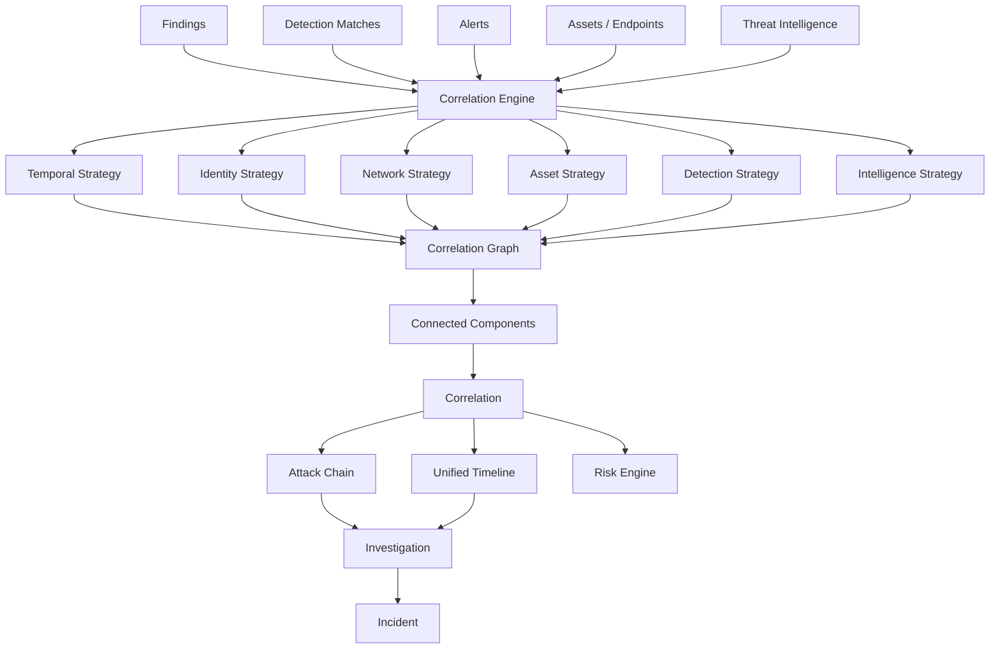

# Correlation Engine Architecture

Phase 12 adds a deterministic, explainable engine that links this
platform's own already-persisted security observations — Phase 8
findings, Phase 11 detection matches/alerts, Phase 10 intelligence
records, Phase 2 assets, Phase 7 endpoints — into graphs, scores them,
and, where the evidence classifies into a recognizable sequence,
summarizes them as an attack chain. It never claims a grouping is a
confirmed attack: every status starts `open`, and `confirmed`/`dismissed`
are reached only through an explicit analyst action.

## Scope adaptation

The originating specification assumed SIEM-shaped infrastructure this
platform doesn't have: raw log ingestion, a user/account/session model,
network-flow events, and a job/worker queue. ai-surface is a reconnaissance
and attack-surface-monitoring platform with none of these. Phase 12
adapts the same way Phase 11 did:

- "Events" are `internal/correlation.Observation` values — normalized
  projections of already-persisted findings/assets/endpoints/detection
  matches/alerts/intelligence records, never a separate raw-event table.
- "Identity correlation" becomes correlation of authentication-category
  findings/detections on the same asset — this platform has no login
  event to correlate by username.
- "Network correlation" uses `Asset.IP`, never a new network scan.
- There is no job/worker queue yet (`cmd/worker` still has none — see its
  own doc comment); `ai-surface correlation evaluate` runs synchronously,
  the same pattern `ai-surface detection evaluate` uses for Phase 11.
- No REST API exists anywhere in this platform; the CLI (`ai-surface
  correlation`, `ai-surface chain`) is the sole interface, consistent with
  every prior phase.
- No auth/RBAC/multi-tenancy layer exists; `TargetID` scoping is the
  isolation boundary, as it is everywhere else in this codebase.

## Architecture diagram



## Package layout

```
internal/domain/correlation/     persisted model (Correlation, Node, Edge, AttackChain, AttackChainStage)
internal/correlation/            self-contained engine (zero DB dependency)
    observation.go                Observation, NodeRef, Input
    edge.go                       Relationship, Provenance, Confidence, Edge, dedupEdges
    strategy.go                   Strategy interface
    registry.go                   StrategyRegistry
    engine.go                     Engine.Correlate — per-strategy failure isolation, candidate truncation
    graph.go                      Graph, BuildGraph, ConnectedComponents, LimitDepth
    fingerprint.go                ComputeFingerprint
    scoring.go                    Score, ConfidenceForScore, DeriveSeverity
    chain.go                      StageType, BuildChain, chainConfidence
    explain.go                    Explain
    strategies/                   temporal, identity, network, asset, detection, intelligence + register.go
internal/repository/correlation/ Postgres persistence (6 interfaces, 1 PostgresRepository)
internal/service/correlation/    bridge — observations.go, evaluate.go, chain.go, lifecycle.go, investigation.go, io.go
cmd/cli/commands/{correlation,chain}.go
```

This mirrors the engine/domain/repository/service split every prior
phase (8/9/10/11) uses: the engine package never touches a database and
defines its own mirrored vocabulary (`NodeType`, `Relationship`,
`Provenance`, `Confidence`) rather than importing the domain package —
the same boundary `internal/ruleengine` keeps from `internal/domain/rule`.

## Correlation model

`Correlation` (`internal/domain/correlation/correlation.go`) is a
system-suggested (or analyst-confirmed) grouping. Status:
`open → investigating → confirmed | resolved | dismissed`. `Score`
(0-100) and `Confidence` (`low`/`medium`/`high`, a coarser three-level
scale than Phase 9's five-level `Confidence` or Phase 11's — a
deliberately independent vocabulary, documented in the type's own
comment) are two distinct axes; `Severity` is a third. `Fingerprint`
deduplicates re-evaluation of the same evidence within the same window
(mirrors `internal/ruleengine.ComputeFingerprint`'s upsert pattern).
`ModelVersion` stamps which engine revision produced the row, so
historical results stay interpretable across future engine changes.

## Evidence / graph model

A `Node` (`internal/domain/correlation/node.go`) is a reference — never a
copy — to an already-persisted finding/asset/endpoint/detection_match/
alert/intelligence_record/investigation row, plus a `Role`
(`trigger`/`supporting`). This one type doubles as this platform's
`CorrelationEvidence` record: a second table storing the same
`(correlation_id, type, reference_id)` tuple would itself be the
duplication the spec warns against.

An `Edge` (`internal/domain/correlation/edge.go`) is one strategy's
explained link between two nodes: `Relationship` (`caused`/
`followed_by`/`originated_from`/`targeted`/`associated_with`/
`observed_on`/`related_to`/`enriched_by`), `Provenance`
(`observed`/`inferred`), `Confidence` (`low`/`medium`/`high`), and a
mandatory `Evidence` explanation string. `StrategyID`/`StrategyVersion`
trace every edge back to exactly the logic revision that produced it.

`observed` vs `inferred` is never collapsed: a same-asset link is
`observed` (a real foreign key already recorded elsewhere); a
temporal-proximity link is `inferred` (a pattern this engine noticed).

## Strategies

Six built-in strategies (`internal/correlation/strategies`), each an
independently testable `Strategy` implementation registered into a
`StrategyRegistry` (`register`/`list`/`enable`/`disable`, mirroring
`internal/investigation.Registry` exactly):

| Strategy | Signal | Provenance | Typical confidence |
| --- | --- | --- | --- |
| `asset` | Two observations reference the same asset ID | observed | high |
| `temporal` | Two observations fall within the configured window | inferred | low |
| `identity` | Two authentication-category observations share an asset | inferred | low |
| `network` | Two observations' assets share an IP, different assets | inferred | low |
| `detection` | Two different rules fired on the same asset, in order | inferred | medium |
| `intelligence` | An observation's IP/hostname matches an external intel indicator | observed | provider-derived |

See `docs/detection/correlation-strategies.md` for full documentation
per strategy (purpose, matching logic, false positives, examples).

## Engine

`Engine.Correlate` (`internal/correlation/engine.go`) runs every active,
config-enabled strategy against one `Input`, isolating each strategy's
own failure (one broken strategy never aborts the others — verified by
`TestEngine_Correlate_IsolatesStrategyFailures`), then deduplicates
same-key edges. Given the same `Input` and strategy versions, `Correlate`
always produces the same `Result` — no randomness, no wall-clock reads
inside a strategy.

Candidate selection happens once, centrally, in `Correlate`: observations
beyond `Config.EffectiveMaxCandidates` (default 2000) are truncated
before any strategy runs, so no individual strategy needs its own
truncation logic, and the engine never compares every observation in a
target's history against every other one.

## Graph assembly and connected components

`BuildGraph` materializes every observation an edge actually references
into a bounded `Graph` (`Config.MaxNodes`/`MaxEdges`, default 500/1000) —
an observation with no edge to anything else is never materialized as a
node, since there is nothing to correlate it with.

One `Correlate` call's edges commonly span several genuinely unrelated
situations for a target. `ConnectedComponents` splits the raw graph via
union-find into its separate components, each becoming its own
`Correlation` — this is why a single evaluation can produce zero, one, or
several correlations. `LimitDepth` bounds breadth-first expansion from a
seed node (`Config.MaxDepth`, default 5) for callers that need a
localized subgraph rather than a whole component.

## Deduplication and fingerprinting

`ComputeFingerprint` (`internal/correlation/fingerprint.go`) hashes the
target ID, every node's sorted `(type, reference_id)` identity, and the
earliest node timestamp truncated onto the configured temporal window's
own grid — the same "truncate onto the window's grid" trick
`internal/ruleengine.ComputeFingerprint` uses for Phase 11's detection
matches. Re-evaluating the identical node set within the same window
always yields the same fingerprint, so `UpsertCorrelation` widens
`LastObservedAt` on the existing row instead of creating a duplicate.

## Scoring, confidence, severity

`Score` (0-100) combines: a base for having more than one node; edge
confidence contributions (capped at 40); node-type diversity (capped at
24); the highest severity rank present (capped at 24); and an intelligence
verdict bonus (+12 malicious, +6 suspicious). The exact formula is
documented in `internal/correlation/scoring.go`'s doc comment. It is
never described as a probability of attack.

`Confidence` buckets `Score` (`< 45` low, `< 75` medium, else high) — a
separate axis from `Severity`, which is `DeriveSeverity`'s own
calculation: the maximum severity rank present among nodes, capped one
rank lower when `Confidence` is low (a low-confidence grouping never
presents as loudly as a high-confidence one touching the same underlying
severity).

## Attack chains

`BuildChain` (`internal/correlation/chain.go`) classifies each node into
a generic stage (`initial_activity`, `authentication`, `execution`,
`privilege_change`, `persistence_signal`, `discovery_signal`,
`network_activity`, `data_access`, `impact_signal`) via a documented,
best-effort heuristic (category/rule-category keyword matching — see the
function's own comment). A node that doesn't classify simply contributes
no stage — nothing is invented to fill a gap. Stages are ordered by their
earliest evidence timestamp. Chain confidence is an evidence-weighted
combination of stage confidences, not a bare average, so a
heavily-evidenced high-confidence stage dominates a thinly-evidenced
low-confidence one.

An `AttackChain` is persisted only when at least one stage classifies.
Its `Status` uses the same `open/investigating/confirmed/resolved/
dismissed` vocabulary as its parent `Correlation` — it is a
representation of correlated activity, never itself proof of an attack.

## Explainability

`Explain` (`internal/correlation/explain.go`) lists every contributing
strategy, every edge's own evidence text, the observed time span versus
the configured window, and the score/confidence — then closes with a
fixed disclaimer sentence. It never generates an unsupported conclusion
("attacker compromised the server"); it states only what was observed.

## Investigation, incident, risk, and detection integration

- **Investigation** (`internal/service/correlation/investigation.go`):
  `AttachToInvestigation` creates a Phase 9 investigation, attaches every
  correlation node as evidence, and records
  `EventCorrelationAttached`/`EventAttackChainCreated` timeline events —
  two small, additive `EventType`/`EntityType` extensions to
  `internal/domain/investigation`, the same pattern Phase 11 used.
- **Incident**: this platform already consolidates "incident" into
  "investigation" (see `internal/domain/investigation`'s own package
  doc). A correlation becoming part of an incident is the same operation
  as attaching it to an investigation — no second entity.
- **Risk**: `internal/intelligence/risk` gained one additive factor,
  `OpenCorrelationCount` / `Weights.CorrelationOpen`, wired optionally via
  `Service.WithCorrelations` — a deployment without Phase 12 tables still
  gets a normal, zero-contribution risk calculation.
- **Detection**: Phase 11 detection matches are a first-class node type
  and the sole subject of the `detection` strategy; a match's own
  `Explanation` remains authoritative — correlation only adds an edge
  between matches, never replaces or re-scores them.
- **Intelligence**: intelligence records are labeled EXTERNAL in every
  edge's evidence text (`intelligence.go`'s strategy), never presented as
  observed activity.

## Limits and performance

| Limit | Default | Config key |
| --- | --- | --- |
| Temporal window | 15m (max 24h) | `correlation.temporal.default_window` |
| Max nodes/edges per graph | 500 / 1000 | `correlation.graph.max_nodes` / `max_edges` |
| Max graph expansion depth | 5 | `correlation.graph.max_depth` |
| Max candidates per evaluation | 2000 | `correlation.max_candidates` |
| Max evaluation range | 24h | `correlation.historical_max_range` |

`TemporalStrategy` sorts observations once and only compares neighbors
within the configured window (a sliding window, not all-pairs), keeping
its cost close to O(n log n + k) for a reasonably-spread evidence set.
Benchmarked at 1,000/10,000/100,000 observations — see the Verification
Results in `doc_by_me/reports/phase12-report.md`.

## Security, authorization, privacy

No exploit/brute-force/persistence/evasion/credential-attack code exists
anywhere in this package. No automatic blocking, remediation, account
disabling, or endpoint isolation is implemented — Phase 12 is analysis
only. No automatic threat attribution (attacker identity, threat actor,
country, motive) is ever inferred. Usernames/domains/IPs/URLs are always
treated as data, never executed. `TargetID` scoping is this platform's
isolation boundary at every layer (service, repository, database) — no
correlation, node, edge, or chain is ever returned across targets.
Correlation data is never sent to an external service.

## Testing

41 engine/domain/strategy tests plus 4 benchmarks — temporal window
boundaries, identity/network cross-asset behavior, connected-component
splitting, graph depth/size limiting, fingerprint determinism and
order-independence, engine failure isolation and determinism, chain
stage ordering and gap handling, chain-confidence weighting, and
explanation safety (never asserting a confirmed attack). See
`doc_by_me/reports/phase12-report.md` for the full verification output.
