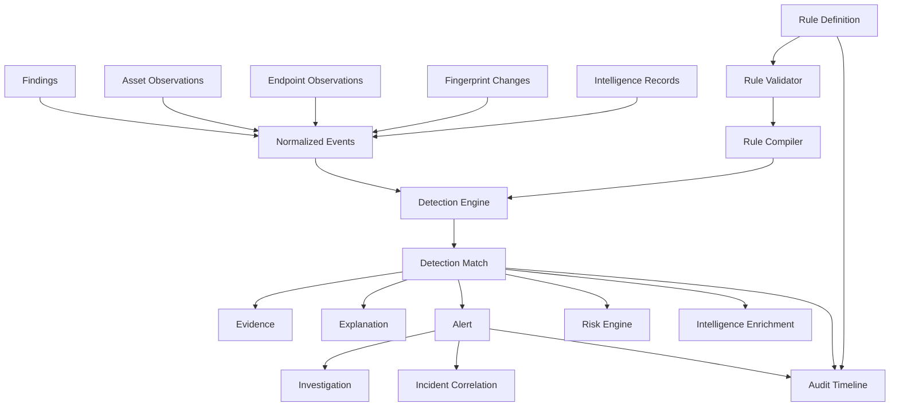

# Detection Rule Engine

Phase 11 lets an analyst define, version, test, and evaluate deterministic
detection rules against this platform's own already-normalized
observations — findings, asset/endpoint observations, technology
fingerprints, and threat intelligence records — producing versioned,
explainable, evidence-backed matches and alerts.

## 1. Detection Architecture

Mirroring every prior phase's split: `internal/ruleengine` has no
database dependency (the same "self-contained engine, thin service-layer
bridge" shape `internal/detection`/`internal/investigation`/
`internal/intelligence` established); `internal/service/rule` is the
bridge. `internal/domain/rule` holds the persisted model; it never
imports another domain package, and the engine never imports it —
`internal/ruleengine` defines its own mirrored `Severity`/`Confidence`/
`EventType` vocabulary, the same discipline `internal/detection.Finding`
uses relative to `internal/domain/finding.Finding`.

**Reused directly, never duplicated**: Phase 2's asset model and target
resolution, Phase 6's technology fingerprints, Phase 7's endpoint
classification, Phase 8's findings, Phase 9's investigation/timeline
infrastructure (extended additively — see §17/§20), Phase 10's
intelligence records and risk model (extended additively — see §19),
`internal/repository/pagination`'s cursor pagination, and this project's
existing `gopkg.in/yaml.v3` dependency for rule import/export.

**New in Phase 11**: `internal/domain/rule` (Rule/Version/
DetectionMatch/MatchEvidence/Alert/Suppression), `internal/ruleengine`
(the rule language, validator, compiler, evaluator), `internal/
ruleengine/builtin` (5 built-in rules), `internal/repository/rule`,
`internal/service/rule`, `cmd/cli/commands/{detection,alert}.go`.

## 2. Rule Lifecycle

`Rule` (`internal/domain/rule/rule.go`) carries identity and current
metadata — `draft → enabled ⇄ disabled → deprecated` (phase11.md §30). A
rule is never hard-deleted; a deprecated rule's history remains fully
queryable. Its `Severity`/`Confidence`/`RuleType` fields are a
denormalized mirror of its *latest* `Version`'s `Definition`, kept in
sync by `RuleRepository.SyncSeverityFromVersion` every time a new
version is created — so `Rule` can never display a severity that
contradicts what its current logic actually produces.

## 3. Rule Language

Four rule types (phase11.md §6), each a small, closed, non-Turing-
complete language:

- **field_match** — one or more `Condition`s checked against a single
  event; each matching event is its own match.
- **threshold** — `Condition`s filter events, `Aggregation.GroupBy`
  groups them, `Aggregation.Window` bounds the group, and
  `Aggregation.Threshold` decides whether the group's count qualifies.
- **aggregation** — the same grouping/windowing machinery as threshold,
  with `Aggregation.Function` of `count` or `unique_count` (over
  `UniqueField`).
- **sequence** — an ordered `Sequence.Steps` list, each with its own
  `EventType`/`Condition`s, matched within `Sequence.Window`.

No rule type executes arbitrary code — there is no expression evaluator,
no scripting hook, and no code-generation path anywhere in this package.

## 4. Rule Schema

Rules are authored as JSON or YAML (phase11.md §7), matching the master
specification's own worked example shape (`window: { duration: 5m }`,
`threshold: { operator, value }`) — see `internal/ruleengine/parser.go`'s
`rawDefinition` and docs/detection/rule-authoring.md for full examples.
The persisted form (`RuleVersion.Definition`) is always the canonical
JSON encoding (`ruleengine.EncodeJSON`), regardless of which format a
rule was authored in.

## 5. Operators

`equals`, `not_equals`, `contains`, `starts_with`, `ends_with`,
`greater_than`, `greater_than_or_equal`, `less_than`,
`less_than_or_equal`, `in`, `not_in`, `exists`, `not_exists`
(phase11.md §8) — a closed enum (`Operator`), never a free-form
expression string.

## 6. Validation

`Validator.Validate` (`internal/ruleengine/validator.go`) returns
structured `ValidationError{Code, Field, Message}` values (phase11.md
§12), covering:

- Unknown fields (`rule.validation.invalid_field`) — never silently
  treated as null (phase11.md §10).
- Operator/field-kind incompatibility
  (`rule.validation.incompatible_operator`) — e.g. `contains` against a
  numeric field.
- Type mismatches (`rule.validation.type_mismatch`) — e.g. comparing a
  numeric field against a non-numeric value (phase11.md §11's own
  `status_code >= "hello"` example).
- Missing/invalid aggregation, threshold, window, and sequence
  configuration.

## 7. Compilation

`Compile(Definition)` (`internal/ruleengine/compiler.go`) validates once
and returns a `CompiledRule{Definition, Hash}` — this engine's rule
language is small and closed enough that `Definition` itself already is
the efficient evaluation-ready form; "compilation" means validated-and-
hashed-once, not a separate bytecode step. `internal/service/rule` is
expected to reuse one `CompiledRule` across an evaluation run rather than
re-validating per call.

`NormalizedHash` (phase11.md §72/§73) hashes only semantically-meaningful
content — conditions/group-by lists are sorted first, so two
equivalently-authored definitions (JSON or YAML, any field order) hash
identically; no timestamp, database ID, or mutable metadata ever
participates in the hash.

## 8. Evaluation

`Engine.Evaluate` (`internal/ruleengine/engine.go`) dispatches by rule
type and is a pure function of `(CompiledRule, []Event)` — the same rule
version, same event set, same configuration always produces the same
matches (phase11.md §14/§55; see `TestEngine_Deterministic`). It performs
no database access, no goroutine spawning, and checks `ctx` once at
entry.

## 9. Threshold Detection

Base `Condition`s filter events; `GroupBy` fields (stringified) key each
group; `Window` bounds a **fixed, non-overlapping** bucket
(`event.Timestamp.Truncate(Window)`) — see §11 for why fixed rather than
sliding. A group's event count is compared against `Threshold`.

## 10. Sequence Detection

A single deterministic left-to-right scan per group: a state machine
advances to the next `Steps[i]` only when an event satisfying that
step's conditions is observed after the previous step's event, with the
whole span bounded by `Window`. Ordering is by `Event.Timestamp`
throughout — never reordered, never inferred.

**Known limitation**: this finds one non-overlapping sequence at a time
per group; a busier interleaving of multiple concurrent candidate
sequences within one group may not enumerate every possible combination.
Documented, not hidden — see §26.

## 11. Aggregation

`threshold` and `aggregation` rule types share one implementation
(`evaluateAggregation`) — `threshold` is simply `aggregation` with
`Function == count`. **Windowing is fixed, not sliding** (phase11.md §43
explicitly allows either; fixed was chosen for determinism and to avoid
emitting a combinatorial number of overlapping near-duplicate matches for
one sustained pattern — downstream fingerprint-based deduplication, not
the engine, collapses repeat evaluations of the same bucket).

## 12. Time Windows

Every window boundary in this engine is **half-open: `[start, end)`**
(phase11.md §44), applied consistently across threshold/aggregation
buckets and sequence spans. `Match.WindowStart`/`WindowEnd` always
reflect this.

## 13. Late Events

Event time is always the underlying observation's own real timestamp
(`Finding.LastSeen`, `Asset.LastSeen`, `IntelligenceRecord.RetrievedAt`,
...), never ingestion/evaluation time (phase11.md §45). `ruleengine.
Config.ClockSkew` (default 2 minutes) is the configured tolerance an
operator can use to decide how far back a re-evaluation window should
extend to catch late-arriving observations; this engine's own evaluation
step does not itself re-open past windows — `internal/service/rule`'s
caller is responsible for choosing `[from, to)` to account for it
(phase11.md §46/§47 — documented, deterministic strategy: "ignore",
via not re-querying already-closed windows automatically).

## 14. Deduplication

`ComputeFingerprint(ruleID, ruleVersion, groupKey, windowStart,
windowDuration)` (phase11.md §33) — `windowStart` is truncated onto the
same `windowDuration` grid the aggregation itself uses, so re-evaluating
overlapping-but-not-identical windows over the same underlying events
still collapses to one fingerprint. `field_match` rules (which have no
natural grouping) synthesize a group key from the triggering event's own
identity, so distinct events never collapse into one match.
`MatchRepository.Upsert` widens `LastObservedAt` on a fingerprint
collision without ever touching an analyst-set `Status`.

## 15. Suppression

`Suppression` (`internal/domain/rule/suppression.go`) scopes to a rule,
match, or alert, always requires a `Reason`, and is never deleted — a
removal sets `RemovedAt`/`RemovedBy`, preserving full history
(phase11.md §35/§36/§37). Suppression never deletes the underlying
events or evidence. `Service.Evaluate` checks active rule- and match-
level suppression before creating a new alert; an already-suppressed
match's re-observation is silently absorbed (`LastObservedAt` widens,
status stays `suppressed`).

## 16. Alert Lifecycle

`open → acknowledged → investigating → resolved` / `suppressed`
(phase11.md §21) — `AlertRepository.Upsert` keys on
`detection_match_id` (one alert per match), widening `LastObservedAt`
without reverting an analyst's status decision. Resolving/acknowledging/
suppressing an alert never mutates or deletes its underlying
`DetectionMatch` or evidence.

## 17. Investigation Integration

`Service.PromoteToInvestigation` (phase11.md §22/§99) creates a Phase 9
`Investigation` directly via `internal/repository/investigation`
(bypassing Phase 9's own correlation-engine-backed service, which this
package has no need for), attaches every piece of the match's evidence
as `EvidenceRef` rows, and appends one `TimelineEvent`
(`EventDetectionMatchCreated` — a small, additive extension to Phase 9's
`EventType`/`EntityType` enums, phase11.md §102's own hedge: "unless the
existing model explicitly supports both"). The analyst never needs to
manually reconstruct the evidence chain.

## 18. Correlation Integration

Phase 11 implements no second correlation engine (phase11.md §97).
Detection matches feed Phase 9's correlation engine only via
`PromoteToInvestigation`'s evidence attachment — once findings/assets
referenced by a match's evidence are attached to an investigation,
`ai-recon investigate correlate` (Phase 9, unmodified) can reason over
them exactly as it already does for any other attached evidence.

## 19. Risk Integration

Phase 10's risk model is extended, not replaced (phase11.md §98,
`internal/intelligence/risk`): `Input.OpenDetectionMatchCount` and
`Weights.DetectionMatchOpen`/`DetectionMatchRepeatedPerCount`/
`DetectionMatchRepeatedMax` add one documented `detection_match` factor.
Wiring is optional — `intelligencesvc.Service.WithDetectionMatches`
(called by CLI wiring in `cmd/cli/commands/intel.go`) — so a deployment
without Phase 11 tables still risk-scores normally. **Known limitation**:
detection matches are scoped by target, not consistently by one asset (a
sequence/aggregation match may span several assets), so this factor
currently reflects the *target's* open-match count uniformly across
every asset in it, not a precise per-asset count.

## 20. Performance

`Engine.Evaluate` is benchmarked at 1,000/10,000/100,000 synthetic events
(phase11.md §115 — see `internal/ruleengine/bench_test.go`); dominant
cost is sorting each group's events (`O(n log n)`), which scales
predictably. `internal/service/rule`'s event-assembly (`events.go`) pages
through Phase 2/6/7/8/10 repositories via existing cursor pagination
rather than loading unbounded result sets (phase11.md §59) — endpoint
observations are the one exception, queried per-asset since
`internal/repository/endpoint` has no direct target-scoped listing (a
pre-existing repository limitation, not new to this phase).

## 21. Security

No exploit, credential-attack, brute-force, persistence, lateral-
movement, or evasion code exists anywhere in this package (phase11.md
§128). No autonomous response exists — no firewall/IP/account/process/
host/cloud modification (phase11.md §127). No automatic threat
attribution — nothing in this model infers an attacker identity, threat
actor, country, or motive (phase11.md §129). Rule definitions are data,
never executed as code; imported definitions are validated before
persistence and never evaluated during import (phase11.md §71).

## 22. Authorization

This platform has no authentication/authorization layer in any phase to
date — every entity (`Rule`, `DetectionMatch`, `Alert`, `Suppression`) is
scoped by `TargetID` exactly like every other entity since Phase 2, which
is the only isolation boundary that exists. Multi-analyst RBAC
(phase11.md §67/§92) is out of scope until this platform adds an
authentication system — see Known Limitations.

## 23. Testing

`internal/ruleengine`: 36 tests + 5 benchmarks (condition evaluation,
validator error codes, compiler/hash determinism, field_match/threshold/
aggregation/sequence evaluation including boundary and out-of-order/
exceeds-window negative cases, fingerprint determinism and group-
sensitivity, JSON/YAML round-trip). `internal/ruleengine/builtin`: every
built-in rule carries its own positive/negative/boundary regression
suite (phase11.md §52/§119), run both as a Go test and via `ai-recon
detection builtin test <name>`. `internal/domain/rule`: 6 tests
(validation, status/suppression logic).

## 24. Rule Versioning

`RuleVersion` (renamed `Version` internally to avoid a `rule.RuleVersion`
stutter) has no `Update` path anywhere in this codebase — every edit is a
new row via `RuleVersionRepository.CreateVersion`, which computes the
next sequential version number server-side. A historical
`DetectionMatch`'s `(RuleID, RuleVersion)` pair always remains
resolvable to the exact `Definition` that produced it (phase11.md §54/
§55).

## 25. Event Schema Compatibility

`Definition.SchemaVersion` (default `1`,
`domainrule.DefaultEventSchemaVersion`) declares which normalized-event
field schema (`internal/ruleengine.DefaultSchema`) a rule was authored
against (phase11.md §104/§105). This phase introduces exactly one schema
version; no migration mechanism exists yet because there is nothing to
migrate from — phase11.md §106's "no silent rewriting" requirement is
honored trivially until a second schema version is introduced.

## 26. Known Limitations

- **No raw log ingestion.** This platform has none, and Phase 11 does
  not add one (per explicit direction). "Events" are projections of
  already-normalized Phase 2/6/7/8/10 rows — see §1.
- **No authentication/authorization/multi-tenancy RBAC.** This platform
  has none in any phase; `TargetID` scoping is the only isolation
  boundary.
- **No scheduler/job system.** Evaluation is CLI-invoked
  (`ai-recon detection evaluate`), not automatically run on a cron
  (phase11.md §32's "existing scheduler" does not exist here) — an
  operator wires external cron/CI to invoke it periodically if desired.
- **Sequence detection finds one non-overlapping match per group at a
  time** — see §10.
- **The detection_match risk factor is target-scoped, not per-asset** —
  see §19.
- **Endpoint-observation event assembly is per-asset** (N+1 queries) —
  see §20.
- **No audit trail beyond status+timestamp for alert lifecycle actions**
  (who/why for every acknowledge/resolve) — would require an auth layer
  this platform doesn't have.
- Database-dependent verification (migration application, live
  evaluation against real event data) could not run this session —
  PostgreSQL/Redis were down throughout, the same constraint every
  report since Phase 6 has documented.
