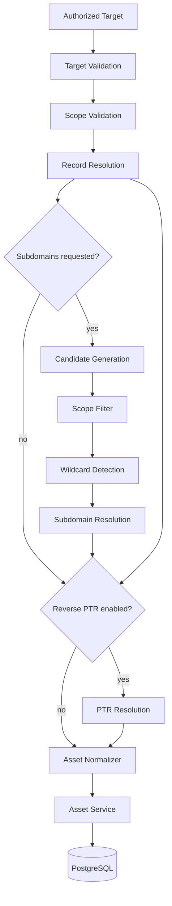

# Phase 5 Architecture: DNS & Subdomain Discovery Engine

This document describes the DNS record and subdomain discovery engine
built in Phase 5 — the platform's third reconnaissance capability,
alongside Phase 3's HTTP discovery and Phase 4's network discovery. It
does not describe certificate-transparency-based subdomain discovery,
zone transfers, DNSSEC validation, or DNS-over-HTTPS/TLS, none of which
exist yet and none of which this phase implements (phase5.md §2/§45).
**DNS discovery never itself performs an HTTP request or triggers HTTP/
network scanning** (phase5.md §3/§46/§47/§79) — a discovered name is only
ever flagged `HTTPCandidate = true` metadata for a later, separately
invoked Phase 3 pass; nothing in this phase calls `Service.Run` or
`Service.RunNetwork`.

## DNS discovery architecture



Package map:

```text
internal/discovery/
├── dns/        the engine — name normalization, resolver abstraction,
│                record types, resolution-state classification, candidate
│                generation, wildcard detection, TXT secret redaction,
│                bounded-concurrency scanner
└── service/    discovery.go (Phase 3, HTTP), network.go (Phase 4), and
                 dns.go (Phase 5) — the SAME orchestrator: authorization +
                 scope + persist

cmd/cli/commands/dns_scan.go        `ai-recon dns-scan` / `subdomain-scan`
test/fixtures/dns/                  local, fully offline authoritative-
                                     style UDP DNS test server
```

**Phase 5 integrates into the same discovery architecture Phase 3/4
established rather than duplicating it** (phase5.md §4):
`internal/discovery/service.Service` gained one new method, `RunDNS`, in a
new file (`dns.go`) alongside the existing `discovery.go`/`network.go`. No
second orchestrator, no second `TargetService`/`AssetService` wiring, no
second database connection.

## Target handling

DNS discovery accepts `DOMAIN` and `HOST` targets — `IP`/`CIDR`/`URL`
targets (Phase 3/4's territory) are rejected before any query is made. The
target's value is the domain name discovery starts from; it is never
mutated except through `NormalizeName` before use.

## Authorization

`Service.RunDNS` loads the target, validates it, and checks
`Target.IsAuthorized()` — **before generating a single subdomain candidate
or sending a single DNS query** — the identical discipline Phase 3/4
established, reusing the same `TargetService`/`Target.IsAuthorized()`
call. An unauthorized target fails immediately with "target is not
authorized for active discovery"; `ai-recon target authorize` is the only
way a target becomes `AUTHORIZED` — Phase 5 adds no second authorization
mechanism.

## Scope enforcement

**Scope validation reuses `internal/discovery/http.ScopeValidator`
directly** — a deliberate choice, unlike Phase 4's necessary non-reuse for
IP/CIDR targets. DNS scope is exactly the concept `ScopeValidator` already
implements: a candidate is in scope if its host is an exact match for the
target domain, or a strict label-boundary subdomain of it. Every
wordlist-generated candidate is, by construction, already a subdomain of
the target domain (`GenerateCandidates` always suffixes it via
`JoinLabel`), so `filterInScope` (`internal/discovery/dns/scanner.go`) is
defense in depth rather than the primary enforcement point — but it is
still exercised directly (`TestFilterInScope_RejectsOutOfScopeAllowsInScope`)
against a synthetic out-of-scope name (`evil-example.test` against a
target of `example.test`) to prove the check itself is correct, since the
generation pipeline can't produce a failing case to feed through the real
CLI path.

## Name normalization

`internal/discovery/dns.NormalizeName` is the single deterministic
normalization path every name passes through before comparison,
deduplication, or being sent to a resolver: lowercased, trailing dot
stripped, each label validated (1–63 characters, non-empty), IDNA-aware
(internationalized labels convert to their ASCII/punycode form via
`golang.org/x/net/idna`'s `idna.Lookup` profile — the same profile used
for the actual query), and the whole name capped at 253 characters.
`"API.Example.Test."` and `"api.example.test"` normalize identically;
`"café.example.test"` normalizes to `"xn--caf-dma.example.test"`.

## Resolver abstraction

`internal/discovery/dns.Resolver` is a two-method interface
(`Lookup(ctx, name, RecordType)`, `LookupPTR(ctx, ip)`) — the scanner
depends only on this interface, never a concrete DNS implementation, so it
is usable from the CLI, a future REST API, or a future worker without
coupling to any of them (phase5.md §6). There is exactly one concrete
implementation (`resolver`, built on `github.com/miekg/dns`), with two
constructors that differ only in which servers they query:
`NewExplicitResolver` (an operator-supplied `host:port` list — what every
test and the local fixture use) and `NewSystemResolver` (reads
`/etc/resolv.conf`). Go's standard-library `net.Resolver` cannot express
SOA/CAA structured records, TTL, or protocol-level rcodes (NXDOMAIN vs.
SERVFAIL vs. NODATA) — the justification for taking on `miekg/dns` as a
new dependency instead of using the stdlib resolver.

## Supported record types

Eight forward-query types — `A`, `AAAA`, `CNAME`, `MX`, `NS`, `TXT`,
`SOA`, `CAA` — plus `PTR`, which is reverse-only and deliberately excluded
from `config.validDNSRecordTypes`/`ValidForwardType` (it can never appear
in a `record_types` configuration list; it is only ever produced by
`LookupPTR`). `SOA` and `CAA` carry their full structured fields
(`SOAData`: primary NS, mailbox, serial, refresh, retry, expire, minimum
TTL; `CAAData`: flag, tag, value) rather than being flattened to a single
string. A record's natural identity (`Record.Identity()` /
`Record.Fingerprint()`) is `name + type + normalized value + priority`
(MX only) — **never TTL, never scan_id, never a timestamp** — the same
"scan_id/volatile-field defeats dedup" lesson Phase 3 learned the hard way
(see `docs/architecture/http-discovery.md`), applied proactively here:
TTL is excluded because a real resolver's TTL naturally counts down even
when the underlying DNS answer hasn't changed at all.

## Resolution-state classification

`internal/discovery/dns.ResolutionState` distinguishes five outcomes,
never collapsed together (phase5.md §26/§27):

- **RESOLVED** — the query succeeded and returned at least one record of
  the requested type.
- **NXDOMAIN** — the server authoritatively reported the name does not
  exist at all (RCODE `NXDOMAIN`).
- **NO_ANSWER** (NODATA) — the query succeeded (RCODE `NOERROR`) but
  returned no records of the requested type: the name exists, just not
  with this record type.
- **TIMEOUT** — the query's deadline (or the scan's context) was exceeded
  before a response arrived.
- **ERROR** — anything else: SERVFAIL, REFUSED, a malformed response, or
  any other transport/protocol failure.

`classify` handles the protocol-level cases (rcode + records);
`classifyTransportError` handles the transport-level cases
(`errors.Is`/`errors.As`-based, never string matching) when the exchange
itself failed before a response arrived.

## Subdomain candidate generation

`internal/discovery/dns.GenerateCandidates` deterministically builds a
wordlist-driven candidate list: depth 1 is `<word>.<domain>` for every
word; depth 2+ combines words onto the *previous depth's* names only
(never unbounded recursive expansion). Every candidate is normalized and
deduplicated *before* counting toward `max_candidates`, so
`"API.example.test"` and `"api.example.test."` consume the budget once,
not twice. Output is sorted for determinism, and generation stops
deterministically at `max_candidates` — always the same prefix of
candidates in the same order, never a random sample (phase5.md §22–§25).
A candidate is only a *discovered* subdomain once it actually resolves
(`SubdomainResult.Succeeded()`); mere presence in a wordlist is never
sufficient (phase5.md §26).

## Combinatorial depth: a real bug found via manual testing

The subdomain depth ceiling was originally a single shared setting
(`discovery.dns.subdomains.max_depth`, default 3) with no per-profile
override. Manually running `dns-scan --profile quick` produced 155
subdomain candidates from a 5-word list — directly contradicting the
`quick` profile's "narrow, fast enumeration" intent. **Fix**: added
`MaxDepth` to `config.DNSProfileConfig` (0 = inherit the base setting),
set `quick.MaxDepth=1`, `standard.MaxDepth=1`, `comprehensive.MaxDepth=2`,
and changed the *base* default itself from 3 to 1 (the same "conservative
by default, opt into more" philosophy every other phase's defaults
follow) — the profile-less base case had the identical bug (84 candidates
from a 4-word list instead of 4). Precedence is: an explicit `--max-depth`
CLI flag (`DNSRequest.MaxDepthOverride`) wins over a named profile's
`MaxDepth`, which wins over the base config default. Re-verified after
the fix: `quick` on a 5-word list produces exactly 5 candidates;
`subdomain-scan --wordlist <4 words>` with no profile produces exactly 4.

## Wildcard detection

`internal/discovery/dns.DetectWildcard` resolves 3 randomized,
near-certainly-unused labels (`wc-<16 hex chars>.<domain>`) under the
target domain and checks whether **all three** resolve to the same
non-empty, sorted record-value set — a single coincidental resolution
never produces a false wildcard conclusion (phase5.md §29). If a wildcard
baseline is established, every subsequently-resolved subdomain candidate
is compared against it (`WildcardDetection.MatchesWildcard`): a candidate
whose result set is indistinguishable from the baseline is flagged
`WildcardAffected = true` and excluded from `SubdomainsDiscovered`/asset
persistence (it's noise, not a genuine discovery), while a candidate whose
result *differs* from the baseline — even though it resolves under the
same wildcard domain — is still recognized as a real, independent
discovery (phase5.md §58). No asset or `Record` is ever created for the
random probe names themselves. Verified end-to-end against the local
fixture's `wildcard.example.test` zone: `random1`/`random2` (unconfigured)
both resolve to the wildcard's `203.0.113.50` and are correctly flagged
`(WILDCARD)`/excluded, while `api.wildcard.example.test` (an explicit,
distinct A record of `192.0.2.77`) is correctly recognized as genuine.

## Reverse PTR lookups

When `discovery.dns.reverse_ptr` is enabled, every unique A/AAAA address
discovered across the domain's own records and every succeeded subdomain
result (`discoveredIPs`, deduplicated and sorted) gets a bounded-
concurrency `LookupPTR` call. This is a lookup for an already-discovered,
in-scope address the scan itself just found — never unrestricted reverse-
DNS range scanning (phase5.md §19); there is no code path that PTR-queries
an address the scan did not itself discover via a forward record.

## TXT secret redaction

TXT records are unstructured free text, so Phase 2's generic key-based
`internal/domain/asset.SanitizeMetadata` (which only inspects map *keys*)
cannot catch a secret embedded inside the text itself — a TXT record whose
entire value is `"api_key=sk-live-abc123"` has exactly one metadata key
(`"value"`), which isn't sensitive-looking at all. `internal/discovery/
dns.SanitizeTXTValue` scans TXT content for `key=value`/`key: value` pairs
whose key matches a sensitive-fragment vocabulary (password, secret,
token, api_key, credential, authorization, ...) and redacts only the value
half, leaving the record's structure intact — a legitimate
`"v=spf1 -all"` SPF record or a DMARC record is untouched, since neither
`v` nor `p` match the vocabulary. This runs inside the resolver
(`parseAnswers`), before a TXT record's value ever leaves it — the
mandatory boundary between an observed record and anything logged or
persisted.

## Concurrency and rate limiting

Every phase of `Scanner.Scan` (record resolution, subdomain resolution,
PTR resolution) bounds concurrency with a buffered-channel semaphore sized
to `discovery.dns.max_concurrency` (default 20) — never one goroutine per
name unbounded. Every goroutine selects on `ctx.Done()` both while
acquiring the semaphore and immediately after, and each phase joins its
goroutines with a `sync.WaitGroup` before returning — the same leak-free
guarantee Phase 3/4 document. `go test -race ./...` passes across the
whole repository, including this package's own concurrent-scan tests. An
optional rate limiter (`discovery.dns.requests_per_second`, default `0` =
unlimited) paces queries with a fixed-interval `time.Ticker` — a safety/
stability control, never randomized/stealth timing.

## Asset normalization

`Service.persistHostRecords` (in `internal/discovery/service/dns.go`) maps
resolved records onto Phase 2's `asset.Input`: `Type = DOMAIN` for the
target domain itself, `Type = SUBDOMAIN` for a discovered subdomain,
`Type = IP` for every unique discovered A/AAAA address, `Source = "dns"`
(distinct from `"http"`/`"network"`, so every asset stays attributable to
the discovery pass that found it). Confidence is `0.7` for a hostname
backed by at least one resolved record (a DNS answer confirms the name
exists and points somewhere, not that any application is listening
there — on par with Phase 4's bare-TCP-reachability confidence) and `0.6`
for an IP address derived from an A/AAAA record (confirmed to be what a
name currently resolves to, not confirmed reachable — no connection is
attempted here; that's Phase 4's separate job). **Only genuinely
discovered subdomains are persisted** (`SubdomainResult.Succeeded()` —
resolved and not wildcard-affected); NXDOMAIN/NODATA/wildcard-noise
candidates create no asset row.

## Evidence and historical DNS tracking

Every individual record gets its own immutable `DNS_RECORD` evidence
entry via `AssetService.RecordObservation` — multiple A records for the
same hostname are never collapsed into one. `recordEvidenceData`
deliberately **excludes both `scan_id` and TTL** from the map Phase 2's
evidence deduplication fingerprints (`record_type`, `name`, `value`,
`priority`/SOA/CAA fields only) — both fields legitimately change on every
re-scan of an *unchanged* underlying record (scan_id by design, TTL as a
real resolver counts it down), and including either would make every
re-scan create a brand-new evidence row forever. The asset's `Metadata`
is a separate concern: a folded snapshot of every record type observed in
the *latest* scan (`buildHostMetadata`) — Phase 2's JSONB metadata merge
replaces keys rather than accumulating history, so metadata is always
"latest state", while full historical DNS state lives in the evidence
list, never erased when a record changes (phase5.md §37). Verified
directly against PostgreSQL: re-running a scan against an unchanged zone
adds zero new evidence rows (dedup holds); modifying the fixture's A
record and re-scanning adds exactly one new evidence row while the
original is preserved untouched, and the asset's `FirstSeen` stays fixed
while `LastSeen` and `Metadata` (the latest-snapshot value) advance.

## CLI usage

```sh
ai-recon target create --name "local test" --type DOMAIN --value example.test
ai-recon target authorize --id <uuid>
go run ./test/fixtures/dns/cmd/dnsserver -port 5300   # local fixture, no public DNS
ai-recon dns-scan --target example.test --resolvers 127.0.0.1:5300 --format table
ai-recon subdomain-scan --target example.test --resolvers 127.0.0.1:5300 --wordlist words.txt
ai-recon dns-scan --target example.test --profile comprehensive --dry-run
```

`subdomain-scan` is a thin alias for `dns-scan` with subdomain enumeration
always on and the record-type table suppressed from output (phase5.md
§49/§73) — both are built from one shared `newDNSCommand` in
`cmd/cli/commands/dns_scan.go`. Flags: `--target` (required),
`--target-type` (default `DOMAIN`), `--record-types` (CSV, `dns-scan`
only), `--subdomains` (bool, default true, `dns-scan` only), `--wordlist`,
`--max-candidates`, `--max-depth`, `--profile`, `--format` (`table`/
`json`), `--timeout`, `--concurrency`, `--rate`, `--resolvers` (CSV
`host:port` — points the CLI at a specific resolver, e.g. the local test
fixture, instead of the system resolver), `--dry-run`. `subdomain-scan`
requires either `--wordlist` or `--profile`. Operational logs always go to
stderr, so `--format json`'s stdout is always valid, log-free JSON.

## Configuration and profiles

`discovery.dns.profiles` (`quick`, `standard`, `comprehensive` by
default) are entirely data — named record-type + subdomain-word +
max-depth combinations in configuration, never hard-coded in Go. Depth
precedence, most to least specific: explicit `--max-depth` flag > named
profile's `max_depth` (0 = inherit) > base `discovery.dns.subdomains.
max_depth`. `discovery.dns.subdomains.max_candidates` (default 10,000) is
a hard ceiling generation deterministically stops at; `comprehensive`'s
50-word list at depth 2 reaches exactly that ceiling and stops there,
never exceeding it.

## Dry-run

When `security.dry_run` is `true` (or `--dry-run` is passed),
`Service.RunDNS` resolves the profile and generates the subdomain
candidate list, but never builds a `Resolver` or sends a single DNS
query — nothing is looked up, and nothing is persisted (phase5.md §53).
`ai-recon dns-scan --dry-run` prints exactly the record types and
candidate names that would have been queried.

## Failure handling

`internal/discovery/dns.Scanner` isolates every name/type's outcome — a
`TIMEOUT`/`ERROR`/`NXDOMAIN` result never aborts the scan — and
`Service.persistDNSSummary` applies the same isolation one layer up: a
persistence failure for one name is logged
(`dns_discovery_persist_failed`) and does not abort the rest of the run
(phase5.md §46). Configuration errors (unknown profile, invalid resolver
address, unsupported target type) are rejected before any DNS activity,
distinctly from a per-name runtime failure.

## Test infrastructure

`test/fixtures/dns` is a deterministic, fully local authoritative-style
UDP DNS server (`github.com/miekg/dns`'s `dns.Server`) — no public DNS
dependency anywhere in the test suite (phase5.md §57). It distinguishes
NXDOMAIN (`dns.RcodeNameError`, name genuinely unknown) from NODATA
(`dns.RcodeSuccess` with an empty answer, name known but not this type)
via an internal `names` set, separately from its `zone` record map, and
supports live mutation (`SetRecords`/`SetWildcard`) so a test can simulate
a real DNS change mid-run. `test/fixtures/dns/cmd/dnsserver` is a
standalone binary (`-port` flag) for manual CLI verification against a
fixed, predictable address. Unit tests (`internal/discovery/dns/*_test.go`)
cover normalization, record identity/fingerprinting (including TTL
exclusion), resolution-state classification (NXDOMAIN/NODATA/SERVFAIL/
timeout/cancellation, each asserted distinctly), candidate generation
(dedup, depth, max-candidates cap, determinism), wildcard detection
(including the "distinct record under a wildcard domain" case), scope
filtering, and TXT redaction — against both hand-rolled mocks and the real
fixture over UDP. `test/integration/dns_persistence_test.go` covers the
same behaviors end-to-end through real PostgreSQL: asset/evidence
creation, re-scan idempotency, historical evidence preservation across a
simulated DNS change, wildcard exclusion, scope enforcement, secret
redaction, unauthorized-target refusal, dry-run, and the max-candidates
ceiling at scale.

## Security boundaries

- No zone transfers (`AXFR`/`IXFR`), no DNSSEC validation, no
  certificate-transparency log queries, no DNS-over-HTTPS/TLS (phase5.md
  §2/§45) — plain UDP/TCP DNS queries via `miekg/dns` only.
- **DNS discovery never performs an HTTP request and never triggers HTTP
  or network scanning itself** (phase5.md §3/§46/§47/§79) — a discovered
  name is only ever flagged `HTTPCandidate` metadata; composing it with
  Phase 3 is left to a future orchestration phase or an operator manually
  running `ai-recon scan` next.
- No randomized/stealth query timing — the optional rate limiter uses a
  fixed interval, purely for target stability.
- Reverse PTR lookups only ever target an address this scan itself
  discovered via a forward record — never unrestricted reverse-DNS range
  scanning.
- TXT record content is redacted for embedded secrets before it is ever
  logged or persisted, on top of Phase 2's existing key-based metadata
  redaction.
- Never logged: credentials, tokens, private keys, or any TXT-embedded
  secret matched by `SanitizeTXTValue` — DNS logging is metadata-only
  (name, type, resolution state, duration, record count).
