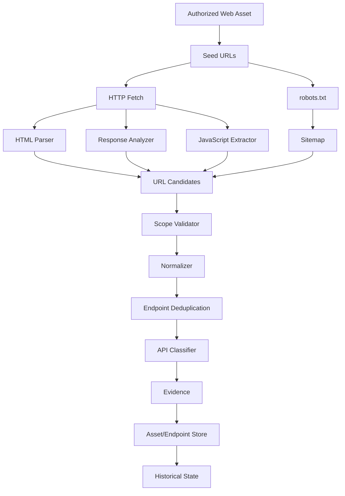

# Phase 7 Architecture: Endpoint & API Discovery Engine

This document describes the endpoint & API discovery engine built in
Phase 7 — the platform's fifth capability, sitting on top of Phase 3
(HTTP), Phase 4 (network), Phase 5 (DNS), and Phase 6 (passive
fingerprinting). It discovers and normalizes application-level endpoints
associated with already-authorized web assets. It is **not** a
vulnerability scanner (phase7.md §3/§90): it inventories `/api/users?id=123`
as an endpoint observation, it never tests `id=123'` or `id=123 OR 1=1`;
discovering `/graphql` classifies an endpoint, it never sends a GraphQL
introspection query or any other operation.

## 1. Endpoint Discovery Architecture



Package map:

```text
internal/discovery/endpoint/    the engine — no database/domain dependency
├── config.go                    Config, profile resolution
├── result.go                    Candidate, Result, Summary, Parameter
├── crawler.go                   the bounded crawler, scope+identity plumbing
├── fetch.go                     one candidate's GET + content dispatch
├── accumulator.go                multi-source corroboration/merging
├── sources.go                    robots.txt / sitemap.xml / well-known API docs
├── normalizer.go                 path-parameter templating (/users/{id})
├── classifier.go                 classification, API type/version, AI/websocket
├── parser.go                     HTML link/form extraction (golang.org/x/net/html)
├── javascript.go                 static JS route extraction, confidence tiers
├── openapi.go                    OpenAPI 3 / Swagger 2 parsing (JSON + YAML)
├── graphql.go                    GraphQL client-reference heuristic
└── api.go                        AI API candidate constants

internal/discovery/service/endpoint.go, endpoint_persist.go
    the bridge: seed resolution, persistence, change detection

cmd/cli/commands/endpoint_scan.go   `ai-surface endpoint-scan`
migrations/000007_extend_endpoints.sql
test/fixtures/endpoint/             local, fully offline HTTP fixture
test/integration/endpoint_persistence_test.go
```

**Phase 7 integrates into the same discovery architecture Phase 3/4/5/6
established rather than duplicating it**: `internal/discovery/service.
Service` gained `RunEndpoint` in new sibling files
(`endpoint.go`/`endpoint_persist.go`) alongside `discovery.go`/
`network.go`/`dns.go` — no second orchestrator, no second `TargetService`/
`AssetService`.

## 2. Crawler

`internal/discovery/endpoint.Crawler.Scan` runs a breadth-first,
depth-bounded crawl: auxiliary sources (robots.txt, sitemap.xml,
well-known OpenAPI/Swagger paths) are processed first and feed their
discoveries into the depth-0 frontier; then each depth level's candidates
are fetched with bounded concurrency (a semaphore, joined via
`sync.WaitGroup` before advancing — the same leak-free pattern every
other discovery engine in this project uses) and any links/forms/JS
routes/OpenAPI operations found become the next depth's frontier.
Concurrency, depth, page count, endpoint count, response size, timeout,
and request rate are all configured limits, never unbounded (phase7.md
§24/§52).

## 3. Scope Enforcement

Every candidate — from a link, a form action, a JS string, a sitemap
`<loc>`, a robots.txt path, or an OpenAPI operation path — is resolved to
an absolute URL (relative to the page it was found on), normalized via
`internal/domain/endpoint.Normalize`, and checked against
`internal/discovery/http.ScopeValidator` — **the exact same scope
mechanism Phase 3 already established**, reused directly rather than
reimplemented (phase7.md §54), because it is exactly the right concept
here too: hostname/subdomain-suffix matching, never a naive
`strings.Contains`. A candidate that fails scope is dropped before any
request is made and counted in `Summary.ScopeRejections`; redirects are
enforced by the same mechanism via `httpclient.Options.AllowRedirectTo`,
so an out-of-scope redirect target is never even transiently connected to
(phase7.md §5/§27).

## 4. URL Normalization

`internal/domain/endpoint.Normalize` (Phase 2, reused unmodified) already
provides everything phase7.md §8 asks for: hostname lowercasing, default-
port omission, dot-segment resolution, trailing-slash policy, fragment
removal, and query-parameter-*name*-only retention (values are discarded
at the normalization boundary — see Parameter Handling below). Phase 7
adds exactly one new normalization layer on top:
`TemplatePath` (`normalizer.go`), which conservatively replaces a
detected dynamic path segment (all-numeric, a canonical UUID, or a long
alphanumeric token containing at least one digit) with `{id}` — so
`/users/123` and `/users/456` collapse to one logical `/users/{id}`
endpoint, while `/users/admin` (an ordinary word, not templated) remains
distinct. Templating is applied only when constructing a `Result`'s
*identity* — the actual HTTP request always targets the real, concrete
URL; fetching a literal `/users/%7Bid%7D` would be a bug, not a
normalization.

## 5. Endpoint Identity

Unchanged from Phase 2: `(asset_id, method, normalized url)`, enforced by
`endpoints_asset_method_url_unique`. This already satisfies phase7.md
§7's "scheme + host + port + normalized path + method" requirement,
since the normalized URL *is* exactly those fields combined. No random
UUID, timestamp, or scan_id is ever part of identity.

## 6. HTML Extraction

`parser.go`'s `ParseHTML` (built on `golang.org/x/net/html`, already a
transitive dependency via `golang.org/x/net` since Phase 5 — no new
dependency was added) statically walks the parsed DOM tree — JavaScript
is never executed — extracting `a`/`area` `href`, `iframe` `src`, `link`
`href`, `script` `src` (and inline `<script>` text, fed to the JavaScript
extractor), and `form` method/action/field-*names* (never field values —
phase7.md §13). Every extracted candidate carries a short, sanitized
evidence snippet (the tag itself, e.g. `<a href="/users">`), never the
page's full content.

## 7. JavaScript Extraction

`javascript.go`'s `ExtractJSRoutes` performs conservative, static regex-
based text analysis — never executing anything. Two confidence tiers
(phase7.md §15's own worked example): a path literal that is the
argument to `fetch(...)`/`axios(...)`/`.open(...)` scores 0.75 (a
genuine API client call site); a bare path-shaped string literal with no
such context scores 0.30. A candidate is never counted at both tiers —
if the same path was reached by a strong signal, the weak fallback match
for the identical string is skipped, so `/api/v1/users` referenced once
via `fetch()` never also produces a redundant weak duplicate. Bare `/`,
whitespace-containing strings, and full external URLs are filtered out
before ever becoming a candidate.

## 8. API Detection

`classifier.go`'s `Classify` derives a `Classification` and, where
evidence supports it, an `APIType`/`APIVersion` from a normalized path
and content type — GraphQL/OpenAPI/Swagger/documentation/sitemap/robots/
auth/static paths are recognized by pattern; a generic `/api/`, `/rest/`,
`/v{n}/` prefix or a JSON content type yields `api`/`rest`; anything else
is honestly `unknown` (phase7.md §16/§32 — never forced into a more
specific bucket without evidence). An explicit `/vN/` path segment yields
`APIVersion = "vN"`; without one, `APIVersion` is `""` (rendered `unknown`
in output) — never guessed from a date or a technology's own version
(phase7.md §17).

## 9. OpenAPI / Swagger

`openapi.go`'s `ParseOpenAPI` decodes a document as JSON first, then as
YAML (both via `gopkg.in/yaml.v3`, already a dependency — no new library)
and extracts, from either OpenAPI 3.x or Swagger 2.0 documents (which
share the same `paths` object shape): path, method, `operationId`,
`summary`, `tags`, parameter *names* (never example values), request/
response content types, and — critically — only the *type* of any
declared authentication mechanism (`bearer`, `apiKey`, `oauth2`, `basic`
— phase7.md §21), never a credential, since OpenAPI documents never
legitimately contain one anyway. `wellKnownAPIDocPaths` is a small, fixed
list (`/openapi.json`, `/swagger.json`, `/v3/api-docs`, ...) — never a
brute-force guesser. Every documented operation becomes a `Documented`
candidate; **no operation is ever automatically invoked merely because
the specification describes it** (phase7.md §19) — a documented `DELETE`
is recorded, never sent.

## 10. GraphQL

A `/graphql` path is classified `ClassGraphQL` by pattern match alone
(`classifier.go`). `graphql.go`'s `ReferencesGraphQLClient` recognizes
common client-library references (`apollo-client`, `gql\``, ...) in
already-fetched JavaScript as an additional corroborating signal. Neither
path ever sends a GraphQL query or attempts introspection (phase7.md
§18/§72).

## 11. Sitemap

`sitemap.go`'s `ParseSitemap` determines a document's real root element
(`urlset` vs `sitemapindex`) before parsing — an empty-but-valid
`<urlset/>` is zero URLs, never a parse error. `sources.go`'s
`processSitemaps` bounds recursion with `MaxSitemaps` (total sitemap
documents fetched, index and leaves combined) and `MaxSitemapURLs`
(total `<loc>` entries recorded), and tracks every visited sitemap URL to
prevent a cyclic sitemap-index reference from looping forever (phase7.md
§22/§73).

## 12. robots.txt

`robots.go`'s `ParseRobots` extracts every `Sitemap:` directive and every
`Allow:`/`Disallow:` path — **as ordinary, identically-treated
candidates** (phase7.md §23, emphasized in the spec itself: "robots.txt
is not an authorization boundary"). A `Disallow: /admin` entry is fetched
exactly like an `Allow:` entry, subject only to the real boundaries:
scope and authorization. Verified directly by
`TestCrawler_RobotsAndSitemap`, which asserts a fixture's
`Disallow: /admin` path is actually requested.

## 13. Parameter Handling

Query parameter *names* come from `Normalize`'s `QueryPattern` (sorted,
deduplicated, comma-joined — values already discarded at that boundary,
per Phase 2's own design). Form field names come from `ParseHTML`. Both
converge on the same `Parameter{Name, Location}` shape and are persisted
in a dedicated `endpoint_parameters` table — independently queryable,
never conflated with the endpoint row's own JSONB metadata. **A value is
never stored anywhere in this pipeline** — not in `Parameter`, not in any
evidence snippet, not in any log line (phase7.md §9/§10/§37).

Sensitive parameter names (`token`, `api_key`, `password`, `session`, ...
— `discovery.endpoint.sensitive_parameters`, mirroring `internal/domain/
asset`'s existing redaction vocabulary) are handled the same way every
other metadata value in this platform is: `SanitizeMetadata` redacts any
metadata *value* whose *key* matches, applied uniformly to everything
Phase 7 persists — no second redaction mechanism was introduced.

## 14. Historical Tracking

Endpoint identity and lifecycle reuse Phase 2's existing `Endpoint`
model unmodified (`FirstSeen`/`LastSeen`/`Status`) — extended, not
duplicated, with Phase 7's new columns (migration `000007_extend_
endpoints.sql`). An endpoint that stops being discoverable is never
deleted; the service layer marks it via the endpoint's own `Status`
lifecycle rather than removing the row, and its full evidence/parameter
history remains queryable.

## 15. Rate Limiting

A fixed-interval `time.Ticker`-based limiter
(`discovery.endpoint.requests_per_second`, default `0` = unlimited) paces
crawl requests — a target-stability control only, never randomized or
stealth timing, matching every other phase's rate limiter in this
project (phase7.md §56).

## 16. Resource Limits

`MaxDepth`, `MaxPages`, `MaxEndpoints`, `MaxResponseSize`, `MaxSitemaps`,
`MaxSitemapURLs`, `MaxConcurrency`, and `RequestsPerSecond` are all
configurable and all enforced (phase7.md §24/§85). `MaxResponseSize` is
enforced by the existing Phase 1 `httpclient.Client` (never more than
`maxResponseSize+1` bytes read); when a response exceeds it,
`errorResult` detects that specific failure and sets `Result.Truncated =
true` rather than crashing or silently dropping the endpoint.

## 17. Security

- **GET only, always.** `fetchFrontier` never issues a request for a
  non-GET candidate (a POST form, an OpenAPI-documented `DELETE`,
  ...) — it's recorded as `Documented`/`Inferred` with `Observed = false`
  and `StatusCode = nil`, never actually sent (phase7.md §13/§30/§31).
- **No credentials submitted, ever** — forms are discovered, never
  filled in or POSTed.
- **No vulnerability testing** — `id=123` is recorded; `id=123' OR 1=1`
  is never constructed or sent (phase7.md §3).
- **No unrestricted crawling** — external hosts are never followed
  (scope-rejected, counted, never requested); every numeric limit above
  is enforced.
- Every value this pipeline persists passes through the same
  `SanitizeMetadata` boundary every other phase uses.

## 18. CLI

```sh
ai-surface endpoint-scan --target example.test --profile quick
ai-surface endpoint-scan --target example.test --profile standard --format json
ai-surface endpoint-scan --target https://example.test --seed https://example.test/app --depth 2
ai-surface endpoint-scan --target example.test --dry-run
```

`--target`/`--target-type`, `--seed` (comma-separated, overrides the
target's own known HTTP(S) assets as the crawl's starting point),
`--depth`/`--max-pages`/`--max-endpoints`/`--timeout`/`--concurrency`/
`--requests-per-second` (config overrides), `--profile`, `--format
table|json`, `--dry-run`. Operational logs always go to stderr, so
`--format json`'s stdout is always valid, log-free JSON.

## 19. API

**No REST endpoints were added**, consistent with Phase 6's own decision:
`internal/httpserver` still serves only `/health`/`/ready` — no asset/
target/scan REST API exists for any resource yet in this platform, so
none was invented here either. `AssetService.ListEndpoints`/
`ListEndpointParameters`/`ListEndpointEvidence` exist and are ready for
whichever future phase adds the platform's first real API surface.

## 20. Known Limitations

- **Source maps are recorded as endpoint candidates when explicitly
  discovered, never automatically fetched or parsed** (phase7.md §36) —
  no source-map-specific handling exists beyond ordinary static-asset
  classification.
- **YAML OpenAPI support is best-effort**: JSON is the primary,
  thoroughly-tested path; YAML documents are decoded via the same generic
  `gopkg.in/yaml.v3` unmarshal and share the identical extraction logic,
  verified by one dedicated test, but have not been exercised against the
  same breadth of real-world OpenAPI documents JSON has.
- **`method_added`/`method_removed` are not separate change types** —
  since this model's endpoint identity already includes `Method`
  (phase7.md §7), a new method appearing for an already-known path
  surfaces as an ordinary `added` `EndpointChange` at that specific
  `(method, url)` identity, which is unambiguous without a second,
  path-grouped comparison pass.
- **AI API candidates are classified by path shape alone within this
  engine** (`AIAPIBaseConfidence = 0.45`, phase7.md §50's own example);
  cross-referencing Phase 6 fingerprint evidence to raise that confidence
  is a natural extension for the service layer, not yet wired in this
  phase.
- Seed resolution (`resolveEndpointSeeds`) considers only assets already
  known for the target from earlier discovery; a target with no prior
  HTTP evidence at all falls back to a single `https://<value>/` seed,
  the same bootstrap Phase 3 uses.
