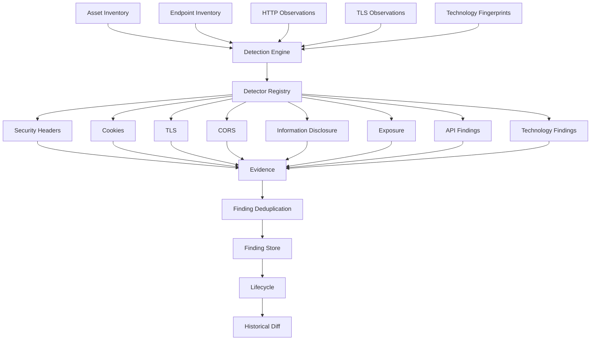

# Finding & Vulnerability Detection (Phase 8)

Phase 8 turns evidence Phase 2-7 already collected and persisted into
normalized, evidence-backed, lifecycle-tracked security **findings**. It
is a detection engine, not a scanner: by default it makes no network
request of its own at all, and even in its optional safe-active mode it
issues only a small, bounded set of requests against already-known or
fixed well-known paths — never an exploit, a credential attack, a
brute-force, or a stealth/evasion technique.

## 1. Detection Architecture



Three packages, three responsibilities, mirroring the split
`internal/fingerprint` / `internal/domain/fingerprint` /
`internal/service/fingerprint` already established for Phase 6:

- **`internal/detection`** — the self-contained engine. No database or
  HTTP-server dependency; it takes an in-memory `Input` (already-persisted
  observations, normalized) and returns in-memory `Finding` values. Its
  only network dependency is `internal/httpclient`, used exclusively by
  the optional safe-active fetcher.
- **`internal/detection/detectors`** — the 22 built-in `Detector`
  implementations across 13 files, plus `RegisterAll`.
- **`internal/domain/finding`** — the persisted model (`Finding`,
  `Evidence`, `Event`), mirroring `internal/domain/asset` /
  `internal/domain/endpoint` / `internal/domain/fingerprint`'s shape.
- **`internal/service/detection`** — the bridge: builds `Input` from
  Phase 2/3/4/6/7's already-persisted data, calls `Engine.Evaluate`,
  persists the result through `internal/repository/finding`, and
  transitions lifecycle state.

Nothing here duplicates an existing HTTP client, scope validator, asset/
endpoint/evidence repository, scan/job system, logging system, or
configuration system — every one of those is reused exactly as Phase 3-7
built it.

## 2. Detector Interface

```go
type Detector interface {
    ID() string
    Name() string
    Description() string
    Version() int
    Category() Category
    Mode() DetectorMode // passive | safe_active
    Detect(ctx context.Context, input Input) ([]Finding, error)
}
```

A detector receives one asset's full `Input` (its own observation, every
endpoint belonging to it, sibling TLS/service observations, and its
active technology fingerprints) and returns zero or more `Finding`
values. It never mutates `Input`, never performs an unbounded request,
and never manipulates state outside its own return value.

## 3. Registry

`Registry` holds every registered `Detector` plus an enabled/disabled flag
per id — no recompilation needed to disable one; configuration
(`detection.detectors` in YAML) drives it directly.
`Registry.Active(mode)` returns every enabled detector eligible to run
under a given `Mode`: passive detectors always run, safe-active detectors
only run when the caller explicitly requested safe-active mode. Every
detector also carries a `Version()` — bumped whenever its detection logic
materially changes, so a persisted finding records exactly which revision
produced it.

## 4. Finding Identity

A finding's identity is **deterministic** — never a timestamp, a random
UUID, or a scan id:

```go
IdentityKey = target_id | asset_id | detector_id [ | endpoint_id ]
```

`Missing HSTS` on `https://example.com` is the same logical finding
across every scan; the same detector firing on two distinct endpoints of
the same asset produces two distinct findings (each carrying its own
`endpoint_id`), never a false duplicate.

## 5. Severity vs. Confidence

Two independent axes, never mixed:

- **Severity** (`informational | low | medium | high | critical`) answers
  "how serious could this issue be" — a property of the condition.
- **Confidence** (`very_low | low | medium | high | very_high`, backed by
  a `[0.0, 1.0]` score) answers "how sure are we the condition is
  actually present" — a property of the evidence.

An expired certificate is `critical`; a certificate expiring in 10 days is
`informational` — the two are never conflated (§25's explicit
requirement).

## 6. Evidence

Every finding carries at least one `Evidence` entry describing exactly
what was observed (a header name and its absence/value, a cookie's
attributes, a TLS certificate's `NotAfter`, ...) — never a bare claim.
Evidence never carries a full response body, a credential, a session
cookie's value, or an already-redacted header's real value; safe-active
detectors that inspect response content (`.env`, error pages, directory
listings) extract only a short, explicitly bounded excerpt
(`detection.max_excerpt_size`, default 2048 bytes) and discard the rest —
the full body is read into memory only transiently by the HTTP client and
never persisted.

## 7. Redaction

`internal/domain/asset.SanitizeMetadata` — the same mandatory redaction
boundary every other phase uses — is applied to every finding's
`Metadata` and every evidence row's `EvidenceData` before either is
persisted. No new redaction mechanism was introduced.

## 8. Passive vs. Safe-Active Detection

Detection defaults to **passive**: every detector reads only Phase
2-7's already-persisted evidence (response headers, cookie attributes,
TLS metadata, endpoint classification, technology fingerprints) — zero
network requests. **Safe-active** mode (`--mode safe_active`, requires
the target be `AUTHORIZED`, exactly like Phase 3/7's active discovery)
additionally allows a detector to issue exactly one bounded, scope-bound
GET per check, and only against:

- an endpoint the platform already discovered (re-checking an
  already-observed 5xx response for a stack trace, or an already-observed
  HTML page for a directory-listing marker), or
- one of a small, fixed set of well-known paths hardcoded in the
  detector's own source (`/.git/HEAD`, `/.env`,
  `/.well-known/security.txt`) — never a wordlist, never a guessed path.

The five safe-active detectors — `exposed_files.git-exposure`,
`exposed_files.env-file-exposure`, `exposed_files.missing-security-txt`,
`error_disclosure.stack-trace`, `directory_listing.autoindex` — share one
`SafeActiveFetcher` interface (`internal/detection/safeactive.go`), whose
only concrete implementation (`HTTPFetcher`) wraps the same
`internal/httpclient.Client` every other discovery engine already uses,
built with its redirect policy bound to the target's `ScopeValidator`
exactly as `internal/discovery/http.NewClientForScope` and
`internal/discovery/endpoint.NewClientForScope` already establish.

## 9. Finding Lifecycle

```
StatusOpen -> StatusResolved -> StatusReopened -> ...
            \-> StatusAcceptedRisk / StatusFalsePositive (sticky)
```

A finding row is never deleted. `internal/detection.NextStatus(previous,
currentlyDetected)` is the pure transition rule: a condition detected
again stays/becomes `open`/`reopened`; one no longer detected becomes
`resolved`; `accepted_risk`/`false_positive` are sticky — a detector
re-observing a suppressed condition never silently reopens it, a human
decision stays in force until explicitly changed via
`findings accept`/`findings false-positive`-equivalent service calls
(`Service.UpdateStatus`). Every transition is additionally recorded as an
immutable `finding_events` row (`finding_opened`, `finding_resolved`,
`finding_reopened`, `finding_accepted`,
`finding_marked_false_positive`, `finding_severity_overridden`) — the
full audit trail, independent of the current-state `findings` row.

## 10. Deduplication

Because `internal/service/detection` hands each detector one
already-multi-source-merged observation per endpoint (Phase 7's own
accumulator already merged HTML/JS/OpenAPI/robots/sitemap evidence into a
single `Endpoint` row upstream), a well-behaved detector emits at most one
`Finding` per identity already. `internal/detection.MergeFindings` is a
safety net on top: it collapses any findings that do share an identity
key within one engine run, unioning their `Evidence`/`References`, taking
the maximum confidence, and the highest-ranked severity.

## 11. Historical Tracking

`internal/repository/finding.Repository.Upsert` follows the same
MIN(first_seen)/MAX(last_seen) discipline every other Upsert in this
project uses. It never touches `Status` — the only two ways a finding's
status changes are `UpdateStatus` (explicit) and `ResolveMissing` (the
"no longer detected" half of one detection run, mirroring
`fingerprint.Repository.MarkInactive` /
`endpoint.Repository.MarkInactiveExcept`).

## 12. Finding Diff

`findings diff --target <t> --scan <id>` reconstructs exactly what
changed during one specific detection run — RESOLVED / PERSISTING /
REOPENED / NEW — entirely from that scan's `finding_events` rows (each
event is stamped with the `scan_id` that produced it), never by
re-running detection or reconstructing point-in-time state.

## 13. Detector Configuration

```yaml
detection:
  enabled: true
  mode: passive # passive | safe_active
  detectors: {} # detector-id -> bool; absent = enabled
  evidence:
    max_excerpt_size: 2048
  thresholds:
    certificate_expiry_days: 14
  timeout: 10s # safe-active only
  max_response_size: 262144 # safe-active only
```

## 14. Security Boundaries

- Safe-active mode requires the target be `AUTHORIZED` — the same
  boundary Phase 3/7's active discovery enforces.
- Every safe-active request is scope-checked via the same
  `ScopeValidator` Phase 3/7 already use; a request can never reach a
  host outside the target's scope, whether directly or via a redirect.
- No detector sends anything but a bounded GET. No detector sends an
  attack payload, tests a credential, brute-forces a path, or attempts to
  bypass a WAF/CAPTCHA/rate-limit.
- Every safe-active request is bounded by `detection.timeout` and
  `detection.max_response_size`.
- One detector's failure never aborts the run — `Engine.Evaluate`
  isolates each detector's error into a structured `DetectorError` and
  continues with the rest (verified by
  `TestEngine_Evaluate_IsolatesDetectorFailure`).

## 15. False-Positive Discipline

Every built-in detector documents its own positive/negative signal
distinction inline. Two examples that came up directly in this project's
own review: a CSP containing a bare `img-src *` is never flagged (only
`script-src`/`object-src` wildcards, or `unsafe-inline`/`unsafe-eval`, are
"weak" — see `security_headers.go`'s `cspLooksWeak`); an error page
containing the word "database" alone is never flagged as information
disclosure (only a structural marker like a Python traceback header or a
`PostgreSQL ... ERROR:` string is — see `error_disclosure.go`'s
`errorMarkerPatterns`).

## 16. CLI

```sh
ai-recon findings scan --target example.com                       # passive
ai-recon findings scan --target example.com --mode safe_active
ai-recon findings scan --target example.com --dry-run
ai-recon findings list --target example.com --severity high --format json
ai-recon findings list --target example.com --format csv
ai-recon findings show <finding-id>
ai-recon findings diff --target example.com --scan <scan-id>
```

## 17. API

No REST API exists for any resource in this project yet (Phase 1's
`internal/httpserver` only exposes `/health`/`/ready`) — Phase 8 adds none
either, consistent with every prior phase's decision.

## 18. Known Limitations

- The technology-vulnerability detector's `VulnerabilityCatalog` ships
  empty by default — this project never hardcodes CVE data (§41/§89); the
  detector, its semver-range matching, and its tests are all fully
  exercised, but it produces zero findings until a real catalog/feed is
  loaded.
- Cookie-attribute and CORS-header capture require the endpoint to have
  been analyzed by Phase 3's full HTTP client (`discovery_method ==
  "http"`); an endpoint discovered only by Phase 7's lighter-weight
  crawler carries no header evidence, so header-dependent detectors
  correctly produce no finding for it rather than a false "missing"
  claim.
- Certificate-expiry detection depends on Phase 4's network scanner
  having actually probed the host's TLS port; an HTTP-only asset with no
  sibling `PORT`/`SERVICE` observation carries no TLS evidence.
- `findings diff` reconstructs a scan's changes from that scan's own
  `finding_events` rows — it does not reconstruct arbitrary point-in-time
  historical state between two unrelated scans.

## 19. Not Implemented (by design)

No SQL injection/XSS/command injection/SSRF exploitation, no
authentication/authorization bypass testing, no credential attacks or
brute-forcing, no destructive requests, no WAF bypass or stealth/evasion,
no fabricated CVE identifiers. A finding states what was **observed**
("CSP was not observed"), never a claim of exploitability ("the
application is exploitable").
