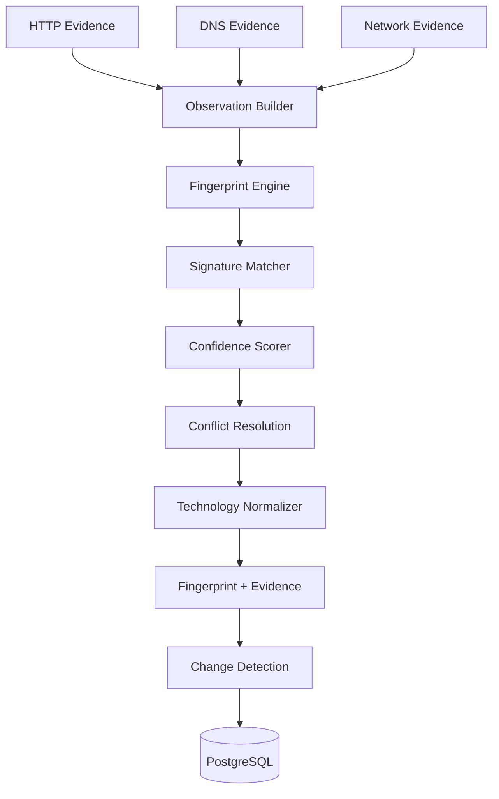

# Phase 6 Architecture: Passive Fingerprinting & Technology Identification

This document describes the passive technology-fingerprinting engine
built in Phase 6 — the platform's fourth capability, sitting on top of
Phase 3 (HTTP), Phase 4 (network), and Phase 5 (DNS) discovery rather
than beside them. It does not describe active probing, vulnerability
scanning, or any form of technology "confirmation" by attacking a target
— none of which exist and none of which this phase implements (phase6.md
§2/§46).

## What passive fingerprinting means

**The engine analyzes evidence Phase 3/4/5 already collected and
persisted. It never performs a network or DNS request of its own —
running `ai-surface fingerprint` twice against unchanged evidence produces
the same result, not a re-scan.** Its responsibility is a fixed pipeline:

```
Observations -> Normalization -> Signature Matching -> Scoring -> Evidence -> Fingerprint -> Historical State
```

never:

```
Fingerprint -> make HTTP request -> probe target -> fingerprint again
```

If evidence doesn't exist for something (Phase 3 never retained a
response body, say), the engine reports nothing for that signal type —
it does not compensate by going and fetching it.

## What data is analyzed / what is NOT collected

Analyzed (all already persisted by earlier phases): HTTP response
headers (a curated safe subset — see below), content-type, status code,
cookie *names*, DNS records (A/AAAA/CNAME/NS), TLS version/cipher/
certificate subject-issuer, Phase 4's port/service classification, and
discovered endpoint paths.

**Never collected or persisted**: authorization headers, bearer tokens,
API keys, passwords, session cookie *values*, access tokens, secrets
embedded in URLs, or full HTTP response bodies. Every value the engine
sees has already passed through `internal/domain/asset.SanitizeMetadata`
before this package ever touches it — this phase adds no second
redaction mechanism, it relies entirely on Phase 2's existing boundary
(see Security below for the one deliberate, narrow addition to it).

## Architecture



Package map:

```text
internal/fingerprint/          the engine — self-contained, no database or
│                                domain dependency (mirrors internal/
│                                discovery/{http,network,dns}'s own
│                                independence from internal/domain/asset)
├── types.go                    Category, SignalType, Level, Thresholds
├── evidence.go                 Observation (the engine's only input shape)
├── signatures.go                Signature/SignalRule schema
├── loader.go                    LoadSignatures — YAML loading + validation
├── normalizer.go                NormalizeTechnology
├── matcher.go                   deterministic signal matching
├── scorer.go                    confidence scoring
├── engine.go                    Evaluate — ties it together, resolves conflicts
├── errors.go                    SignatureError
├── result.go                    Result, Signal (live match output)
├── embed.go                     DefaultSignaturesFS, LoadDefaultSignatures
└── signatures/*.yaml            the built-in signature set (~35 signatures)

internal/domain/fingerprint/    the persisted model — Fingerprint, Evidence,
│                                Signal (JSON-compatible, distinct Go type
│                                from the engine's own Signal — see below)
internal/repository/fingerprint/  Postgres persistence, mirrors
│                                internal/repository/asset's shape exactly
internal/service/fingerprint/   the bridge: builds an Observation from real
│                                Asset/Evidence/Endpoint rows, runs the
│                                engine, persists results, detects changes

cmd/cli/commands/fingerprint.go   `ai-surface fingerprint`
migrations/000006_create_fingerprints.sql
test/integration/fingerprint_persistence_test.go
```

**The engine has no dependency on `internal/domain/fingerprint` or any
database/repository code** — the same "engine is self-contained, the
service layer bridges it to persistence" split
`internal/discovery/{http,network,dns}` already establish relative to
`internal/domain/asset` (phase6.md §47). `internal/service/fingerprint`
is the only package that imports both.

## Signature Engine

### Signature format

Declarative YAML, never a hardcoded switch statement (phase6.md §6):

```yaml
signatures:
  - name: nginx
    category: web_server
    vendor: nginx
    signals:
      - type: http_header
        field: Server
        pattern: "^nginx(/([0-9][0-9.]*))?"
        weight: 0.75
        version_group: 2
      - type: http_header
        field: Via
        pattern: "nginx"
        weight: 0.25
    negative_signals:
      - type: http_header
        field: Server
        pattern: "Apache"
        weight: 1.0
```

`name` (unique across every loaded file), `category` (one of 20
recognized values), `signals` (at least one) are required. `vendor`,
`product`, `negative_signals`, `min_score`, `incompatible_with` are
optional. A `SignalRule` sets either `pattern` (a Go `regexp` — RE2,
which by construction cannot exhibit catastrophic backtracking, phase6.md
§29 — no additional regex-safety layer is needed) or `equals` (exact,
case-insensitive match), never both; `weight` in `(0.0, 1.0]`;
`version_group`, if set, names a capture group in `pattern` holding the
technology's version.

### Signal types

`http_header`/`response_header` (synonyms) and `rate_limit_header`
inspect `Observation.Headers`; `cookie_name` inspects `CookieNames`;
`url_path`/`api_path` inspect the asset's URL path / discovered endpoint
paths; `content_type`, `service`, `port`, `tls`, `response_hash` inspect
their like-named field; `dns_cname`/`dns_record` inspect `DNSRecords`;
`html`/`html_meta`/`script`/`stylesheet`/`json_structure`/
`error_message` inspect fields reserved for a future phase that retains
response-body snippets (see Known Limitations — these are fully
implemented and tested against synthetic fixtures, just never fed by
real persisted data today).

### Matching

`matchSignature` (matcher.go) evaluates a signature's `negative_signals`
first — any match disqualifies it outright (phase6.md §10) — then its
`Required` signals (any missing disqualifies it, phase6.md §32), then
every signal, deduplicating matches by `(Type, Field, Value)` before
scoring (phase6.md §9: identical evidence observed multiple times is
never double-counted). A signature with zero matched signals produces no
result at all — mere presence of a signature is never assumed.

### Scoring

```
score = (sum of matched, deduplicated signal weights) / (sum of every declared signal's weight)
```

"Maximum possible evidence" is every signal the signature *declares*, not
just what matched — so a signature whose only real-world corroborating
signal type isn't available yet (see the database/service candidates
below) is naturally capped at a low score, without a special case. Levels
bucket the score using configurable `Thresholds` (default: 0.00–0.29
weak, 0.30–0.59 low, 0.60–0.79 medium, 0.80–0.94 high, 0.95–1.00
very_high — phase6.md §8's own worked example, `internal/config.
FingerprintConfig.Thresholds`).

### Conflict handling

Two matched signatures are never both reported at full confidence
without qualification (phase6.md §10): if either declares the other in
`incompatible_with`, the lower-scoring one is dropped (`engine.go`'s
`weakerOf`), deterministically. Two matched signatures that don't declare
incompatibility — nginx, Cloudflare, and Next.js, say — coexist freely,
since that's an entirely ordinary real-world stack, not a conflict. When
the *same* header genuinely contains contradictory content (`Server:
nginx, Apache/2.4` — a misconfigured proxy), each signature's own
`negative_signals` disqualifies the other, so neither fires — a stronger,
more explainable outcome than assigning either a fabricated confidence.

### Technology Normalization

`NormalizeTechnology` (normalizer.go) resolves known variants — `Nginx`,
`nginx`, `nginx/1.25.3`, `nginx web server` — to one canonical identity
via a small, explicit, reviewable alias table (phase6.md §11) — never a
fuzzy-matching heuristic, since silently merging two genuinely different
technologies would be worse than an unnormalized duplicate. An unknown
technology is returned unmodified (original casing preserved), never
forced through any convention.

### Version extraction

Only ever populated from an explicit regex capture group
(`version_group`) matched against real evidence (phase6.md §12) — never
inferred from "current known release patterns" or any external database.
`Server: nginx/1.25.3` yields version `1.25.3`; `Server: nginx` alone
yields `""` (rendered `unknown` in CLI/JSON output), never a guess.

## Technology Coverage

| Category | Representative signatures |
|---|---|
| `web_server` | nginx, Apache, IIS, Werkzeug, Caddy |
| `framework` | Express, Django, Flask, Laravel, Ruby on Rails, ASP.NET, ASP.NET MVC, Spring, FastAPI |
| `frontend` | Next.js, React, Vue.js, Angular |
| `cms` | WordPress, Drupal |
| `runtime` / `programming_language` | Node.js, PHP, Python (WSGI) |
| `cdn` / `reverse_proxy` | Cloudflare, Fastly, Akamai, generic reverse proxy |
| `cloud` | AWS, Azure, Google Cloud, Vercel, Heroku |
| `api` | REST API, versioned API, GraphQL, OpenAPI, Swagger, API documentation |
| `ai_provider` / `ai_platform` / `ai_model_candidate` | OpenAI-compatible API, Anthropic-compatible API, Ollama, observed-model-identifier candidate |
| `database` | MySQL, PostgreSQL, Redis, MongoDB candidates |
| `service` / `monitoring` | SSH, SMTP candidates; a Prometheus-style metrics-endpoint signature |

## AI Fingerprinting

**Every AI-category result is a candidate, never a confirmation**
(phase6.md §17). `openai-compatible-api` and `anthropic-compatible-api`
require a discovered endpoint path shape (`/v1/chat/completions`,
`/v1/messages`, ...) — alone, this scores low (path shape is weak,
ambiguous evidence: plenty of self-hosted, open-source tools mimic these
APIs without being the named provider). Confidence only climbs when a
provider-specific response header actually appears (`Openai-
Organization`, `Anthropic-Version`) — real, distinctive evidence, not
another guess from the same path.

`ai-model-candidate` (category `ai_model_candidate`) is the one signature
that can reach full confidence from a single signal — but only because
that signal (`json_structure`, field `model`) inspects
`Observation.ExplicitModel`, a field only ever populated when a
response's own JSON body explicitly named a model. **The engine never
infers a model identifier from endpoint shape** — `/v1/chat/completions`
alone never produces an `ai-model-candidate` result, regardless of
confidence (verified directly:
`TestEngine_AI_WeakVsStrongProviderEvidence` asserts exactly this). When
a model identifier IS observed, the matched signal's value is the exact
observed string, verbatim — never normalized into a claimed model family
or version.

## Database / Service Candidates

**A port number is never treated as confirmation** (phase6.md §19,
verified by `TestEngine_WeakDatabaseCandidate_PortAloneIsLowConfidence`).
Each database signature (`mysql-candidate`, `postgresql-candidate`, ...)
declares two signals: the port match (weight 0.25) and a product-specific
`service` classification (weight 0.75) that Phase 4's current port
classifier never actually produces (it only yields a generic `DATABASE`
bucket for these ports, not a per-product identification) — so the
achievable score from port alone is capped at exactly 0.25, a documented,
deliberate consequence of the ratio-based scoring model, not a special
case. Once a future phase adds real banner/protocol-level confirmation
that sets `Observation.Service` to the specific product name, the same
signature immediately scores high without any signature change.

## Database

`migrations/000006_create_fingerprints.sql` adds two tables, mirroring
`assets`/`asset_evidence`'s current-state/historical-trail duality
exactly:

- **`fingerprints`** — current state. One row per `(asset_id, category,
  normalized technology)` identity (`fingerprints_asset_identity_unique`),
  upserted: `first_seen` takes the earlier of the two timestamps,
  `last_seen` the later (the same `LEAST`/`GREATEST` discipline
  `assets.Upsert` uses), while `confidence`/`version`/`vendor`/`product`/
  `metadata` always take the *new* observation's values — unlike
  `assets.Upsert`'s confidence-max/metadata-merge, a fingerprint expresses
  "what we currently believe," and a re-analysis that finds *weaker*
  evidence than before must be allowed to lower confidence, not be stuck
  at a historical maximum. Indexes: `asset_id`, `target_id`, `technology`,
  `category`, `scan_id`, `confidence`, `status` (phase6.md §21's exact
  required query patterns).
- **`fingerprint_evidence`** — append-only historical trail, one
  immutable row per distinct matched-signal-set snapshot, deduplicated by
  `(fingerprint_id, signals_fingerprint)` — the same
  hash-of-canonical-JSON dedup key `asset_evidence` uses, with `scan_id`
  deliberately excluded from what's hashed (see Historical Tracking
  below).

A fingerprint that stops matching moves to `status = INACTIVE`
(`MarkInactive`) rather than being deleted — its row, `first_seen`, and
every evidence snapshot it ever accumulated are preserved untouched
(phase6.md §22).

## CLI

```sh
ai-surface fingerprint --target example.com
ai-surface fingerprint --asset <asset-uuid>
ai-surface fingerprint --target example.com --format json
ai-surface fingerprint --target example.com --min-confidence 0.60 --category web_server
ai-surface fingerprint --target example.com --explain
ai-surface fingerprint --target example.com --dry-run
```

`--target` analyzes every asset belonging to that target; `--asset`
analyzes exactly one (exactly one of the two is required). `--scan`
attributes persisted fingerprints to a given scan id (defaults to a
freshly generated one per invocation — the same "each run gets its own
id" convention `dns-scan`/`network-scan`/`scan` already follow).
`--dry-run` evaluates and prints results without persisting anything or
computing Changes. `--explain` prints every matched signal's description
beneath each technology. Operational logs go to stderr, so `--format
json`'s stdout is always valid, log-free JSON.

## API

**No REST endpoints were added.** The existing platform has no
asset/target/scan REST API at all yet (`internal/httpserver` serves only
`/health` and `/ready`) — adding fingerprint-only CRUD/read endpoints
would invent a new architectural precedent inconsistent with "reuse
existing patterns, don't create a parallel one" (phase6.md §47.4/§39's
own "do not create unnecessary CRUD endpoints"). `internal/service/
fingerprint.Service.List`/`ListEvidence` exist and are ready for whichever
future phase adds the platform's first real API surface to wire them
into.

## Security

- **Passive-only, always**: the engine package (`internal/fingerprint`)
  performs no I/O of any kind — no `net`, `net/http`, or DNS import
  exists anywhere in it. `internal/service/fingerprint` only ever reads
  already-persisted rows.
- **Secret redaction**: every value the engine sees has already passed
  through `internal/domain/asset.SanitizeMetadata`. One narrow, precise
  extension was made to it: `cookie_names` is now an exact-match
  exception to the substring rule that would otherwise redact it (it
  legitimately contains "cookie" but its value is a list of cookie
  *names only* — never a value; `Set-Cookie`/`Cookie` themselves remain
  fully redacted, unaffected). See `internal/domain/asset/redact.go`'s
  `sensitiveKeyExceptions`.
- **A small, additive Phase 3 extension**: `internal/discovery/http`
  gained `extractCookieNames` (cookie *names* only, extracted from the
  raw pre-redaction header — the already-redacted `Headers` map replaces
  `Set-Cookie`'s entire value with `[REDACTED]`, which would make name
  extraction impossible downstream) and `internal/discovery/service`
  gained a curated, closed allow-list of ~24 additional safe response
  headers (`X-Powered-By`, `Via`, `CF-Ray`, rate-limit headers, ...) —
  every name on it is a framework/CDN/product marker, never a credential.
- **Authorization**: fingerprinting analyzes assets that already exist
  because an earlier, already-authorized discovery scan created them —
  it performs no new authorization check of its own because it makes no
  new request to authorize. An asset that was never legitimately
  discovered has no evidence to analyze.

## Tests

**Unit** (`internal/fingerprint/*_test.go`): signature loading and every
required validation failure (malformed YAML, missing name/category,
invalid regex/weight, duplicate name, unsupported signal type, version-
group out of range); matching (nginx with/without version, conflict
handling, coexisting technologies, corroboration increasing confidence,
duplicate-evidence non-double-counting, weak vs. strong database/AI
candidates, explicit model identifiers, no-evidence, determinism, min-
confidence filtering); scoring and threshold bucketing/validation;
technology normalization. `internal/domain/fingerprint/*_test.go`:
domain validation, identity keys, evidence fingerprinting.
`internal/service/fingerprint/service_test.go`: change detection (added/
removed/version_changed/unchanged/minor-fluctuation-ignored/significant-
change-reported), observation assembly from synthetic metadata, signal
conversion. `internal/discovery/http` and `internal/domain/asset` gained
tests for the Phase 3 cookie-name/redaction extension.

**Integration** (`test/integration/fingerprint_persistence_test.go`, real
PostgreSQL, against a real Phase 3 scan of a local fixture — not a
synthetic `Observation` built by hand): end-to-end persistence with real
matched signatures (nginx + Express), idempotent re-analysis (same row,
same evidence count, `FirstSeen` preserved/`LastSeen` advances), version-
change detection with historical evidence preservation (both the old and
new `Server` header values present as separate evidence rows),
removed-fingerprint handling (moved to `INACTIVE`, row preserved, never
deleted), dry-run (nothing persisted), and an asset with no evidence at
all producing zero fingerprints (never an error).

**Benchmarks** (`internal/fingerprint/engine_bench_test.go`):
`BenchmarkEngine_Evaluate_{10,100,1000}Assets` — pure in-memory matching
against the built-in signature set, no I/O.

## Known Limitations

- **HTML-based signal types have no real backing data today.** Phase 3
  deliberately never retains HTTP response bodies (`phase3.md §14/§23`),
  so `html`/`html_meta`/`script`/`stylesheet`/`json_structure` (beyond
  the special-cased `model` field)/`error_message` signal types — and
  every signature that relies on them (Next.js, React, Vue.js, Angular,
  WordPress's generator meta, Drupal's `/sites/default/` path) — are
  fully implemented, validated, and tested against synthetic fixtures,
  but will not fire against real persisted evidence until a future phase
  adds bounded response-body/snippet capture. This is stated plainly
  rather than left to be discovered: the engine does not overclaim
  coverage it cannot currently back with real data.
- Database/service "candidate" signatures are deliberately capped at low
  confidence today, because Phase 4's port classifier doesn't yet
  identify a *specific* product from a banner — only a generic
  `DATABASE`/`SERVICE` bucket. This is the intended, documented behavior
  (phase6.md §19), not a bug.
- `Observation` cross-references sibling assets sharing the same
  `(TargetID, Hostname)` for DNS/network correlation (one page, up to
  `pagination.MaxLimit` siblings) — a target with more than 500 assets
  sharing one hostname (unrealistic in practice) would not see every
  sibling's metadata folded in.
- No REST API surface (see API above) — none exists for any resource
  yet in this platform.
- No metrics backend wired (consistent with every prior phase — Phase 1
  doesn't have one either; structured log fields carry equivalent
  information: `fingerprint_scan_evaluated`, `fingerprint_change_
  detected`, `fingerprint_analysis_failed`).

## Explainability

Every fingerprint traces directly back to the signals that produced it —
`--explain` prints each one's `Description` (e.g. `Server header matches
"nginx/1.25.3"`), and every persisted `fingerprint_evidence` row carries
the full matched-signal set, never just a final number. This is a
deliberate design property, not an afterthought: `internal/fingerprint`
never produces a confidence score without also producing the signals that
justify it, by construction — there is no code path that sets
`Result.Confidence` without populating `Result.Signals` alongside it.

## Adding a new signature

Add an entry to any file in `internal/fingerprint/signatures/` (or a new
file — `LoadSignatures` globs every `*.yaml` in the directory):

```yaml
signatures:
  - name: my-custom-app
    category: framework
    vendor: Acme Corp
    signals:
      - type: http_header
        field: X-Powered-By
        pattern: "^MyCustomApp/([0-9][0-9.]*)"
        weight: 1.0
        version_group: 1
```

`LoadSignatures` validates it at load time (name/category/signals
required, regex must compile, weight in range, no duplicate name across
every loaded file) — a mistake fails the whole load with a clear,
file-and-signature-named error, never a silent skip (phase6.md §28). An
operator can also point `fingerprint.signatures_path` at an entirely
external directory to use a custom set instead of the built-in one.
