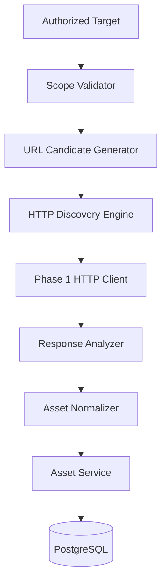

# Phase 3 Architecture: HTTP Discovery Engine

This document describes the platform's first real reconnaissance
capability — HTTP discovery — built entirely on top of Phase 1's HTTP
client/config/logging/error/database infrastructure and Phase 2's asset
persistence layer. It does not describe fingerprinting, port scanning, DNS
enumeration, or any other later-phase capability, none of which exist yet.

## Discovery architecture



Package map:

```text
internal/discovery/
├── http/       the engine itself — config, scope, candidates, request/
│                response handling, analysis, AI-candidate classification,
│                the bounded-concurrency scanner
├── model/      Result/Summary — the engine's output shape
└── service/    orchestration: authorization + scope setup, running the
                 scanner, persisting through Phase 2's AssetService

cmd/cli/commands/scan.go   `ai-surface scan`
test/fixtures/http/        local, fully offline HTTP test fixture
```

`internal/discovery/http` never touches PostgreSQL and knows nothing about
`internal/service/asset`; `internal/discovery/service` never issues an HTTP
request itself. This mirrors phase2.md §3's discovery-source ->
service-layer -> repository architecture with a real discovery source on
top for the first time:

```text
HTTP Discovery (internal/discovery/http)
       ↓
AssetService.RecordObservation / UpsertEndpoint (internal/service/asset)
       ↓
AssetRepository / EndpointRepository (internal/repository)
       ↓
PostgreSQL
```

## HTTP client relationship

Phase 3 adds **zero** new third-party dependencies and **no** second HTTP
transport. `internal/discovery/http.NewClientForScope` builds a normal
`internal/httpclient.Client` (Phase 1) with one addition: a caller-supplied
redirect policy plugged into a new, backward-compatible extension point —
`httpclient.Options.AllowRedirectTo func(*url.URL) bool` — rather than
duplicating `httpclient`'s transport, timeout, response-size-limiting, or
TLS-metadata logic. `AllowRedirectTo` is nil (no additional restriction)
for every existing Phase 1/2 caller; discovery is the first caller to set
it. `httpclient.Response` also gained a `RedirectChain []string` field
(every redirect target's URL, in order), captured via a per-request
context value the shared `CheckRedirect` closure reads — this required no
change to how any existing caller uses the client.

## Candidate generation

`internal/discovery/http.GenerateCandidates` is a pure, deterministic
function: target type + value + configuration + scope in, a deduplicated,
sorted `[]Candidate` (URL + method) out.

- **URL target** (`http://127.0.0.1:8080`): used as-is for its scheme —
  discovery never additionally probes the other configured scheme for an
  explicit URL target (phase3.md §8/§9).
- **HOST / DOMAIN target** (`example.test`): one base URL per configured
  scheme (`discovery.http.schemes`, default `[https, http]`), each on that
  scheme's default port — Phase 3 does not support a configurable port
  list; a specific non-default port is expressed by giving a URL target
  instead.
- Every `base + path` combination is normalized with
  `internal/domain/endpoint.Normalize` (the same normalization Phase 2's
  endpoint identity uses) — lowercased host, cleaned path, no query
  string, no fragment, default port resolved — and deduplicated against
  that normalized form, so `/api` and `/api/` never produce two
  candidates.
- Every candidate is checked against scope before being included (defense
  in depth — see below).
- Paths come entirely from configuration (`discovery.http.paths`, or a
  named `discovery.http.profiles.<name>.paths`) — never hard-coded in Go.

## Scope validation

`internal/discovery/http.ScopeValidator` allows a candidate/redirect target
whose host is an exact, case-insensitive match for the target's host, **or**
a strict subdomain of it (`api.example.test` is in scope for a target of
`example.test`; `evil.example.net` and `notexample.test` — a raw suffix
match without a `.` label boundary — are not). Port is intentionally not
part of the comparison: scope is about not being redirected to a different
organization's host, not about which port on the same host is used.

Scope is enforced in **two** places:

1. **Candidate generation** filters out any candidate that fails scope —
   defense in depth, since every candidate is derived directly from the
   target's own host and should never actually fail this check.
2. **Every redirect hop**, via `httpclient.Options.AllowRedirectTo` (see
   above) — this is the real enforcement boundary. When a hop fails scope,
   the client stops following (the same `http.ErrUseLastResponse`
   mechanism already used for the redirect-count limit) *before ever
   connecting to the disallowed host*. The discovery layer then inspects
   the returned (unfollowed) redirect response's `Location` header against
   scope itself, purely to explain and record the fact — never to decide
   whether to connect — setting `Result.RedirectBlocked` and
   `Result.Skipped` so the event is never silently discarded (phase3.md
   §24) and is never persisted as though it were real endpoint content.

## Authorization

`internal/discovery/service.Service.Run` loads the target by
`(type, value)`, validates it, and checks `Target.IsAuthorized()` —
**before generating a single candidate or sending a single request**. An
unauthorized target fails immediately with "target is not authorized for
active discovery" (phase3.md §7's exact wording). Authorization is set
exclusively via `ai-surface target authorize` (`TargetService.
UpdateAuthorizationStatus`) — a target is never authorized merely by
existing.

## Concurrency

`Scanner.Scan` bounds concurrency with a buffered channel semaphore sized
to `discovery.http.max_concurrency` — never one goroutine per URL
unbounded. Every goroutine also selects on `ctx.Done()` both while
acquiring the semaphore and immediately after, so cancellation (Ctrl+C —
wired to `SIGINT`/`SIGTERM` via `signal.NotifyContext` in `cmd/cli/main.go`)
stops new requests promptly. `Scan` joins every goroutine with a
`sync.WaitGroup` before returning, which is itself the guarantee against
goroutine leaks — `Scan` cannot return while any of its own goroutines are
still running.

## Response analysis

`internal/discovery/http.Analyze` classifies a response using only
observable evidence — status code, content type, request path, and (for a
JSON object response) top-level field names — into one of `UNKNOWN`,
`WEB_APPLICATION`, `API`, `JSON_API`, `DOCUMENTATION`, `HEALTH_ENDPOINT`,
`AI_CANDIDATE`. It never attempts to identify a specific product, vendor,
or model (phase3.md §16) — that is fingerprinting, a later phase.

## AI candidate detection

`internal/discovery/http.ClassifyAICandidate` is a deterministic, weighted
scoring function — no LLM, no machine learning:

| Indicator | Weight | Trigger |
|---|---|---|
| Path pattern | 0.35 | request path matches a known AI/LLM API pattern (`/v1/models`, `/v1/chat/completions`, `/v1/completions`, `/v1/embeddings`, `/chat/completions`, `/api/chat`, `/api/generate`, `/models`) |
| Content type | 0.15 | response content-type is JSON |
| Schema (1+) | 0.30 | response body contains ≥1 of `choices`, `messages`, `model`, `usage`, `prompt_tokens`, `completion_tokens`, `embedding`, `object`, `created` |
| Schema bonus (3+) | 0.20 | ≥3 of the above fields present |

Weights sum to exactly 1.0. `AIEndpointCandidate` is true at confidence
≥ 0.30 — set so the path indicator alone, or the schema indicator alone, is
independently sufficient evidence, while the content-type indicator alone
(too weak — enormous numbers of ordinary, non-AI APIs also return
`application/json`) is not. The result never names a provider or model —
only "AI endpoint candidate: true, confidence: 0.91, evidence: [...]"
(phase3.md §17/§18/§51); `test/fixtures/http`'s `/v1/chat/completions`
fixture is deliberately OpenAI-response-*shaped* to prove this boundary in
tests, while asserting the evidence text never contains "OpenAI" or "GPT".

## Asset normalization

`internal/discovery/service.Service.persist` maps a `model.Result` onto
Phase 2's `asset.Input`: `Type` is `AI_ENDPOINT` if
`AIEndpointCandidate`, else `API_ENDPOINT` if the response classified as
`API`/`JSON_API`, else `HTTP_ENDPOINT`; `Hostname`/`Port`/`Protocol`/`URL`
come from parsing the final (post-redirect) URL; `Source` is always
`"http"`; `Confidence` is a fixed `0.9` ("a completed HTTP response is very
strong evidence this endpoint exists") — deliberately independent of the
AI-candidate confidence score, which answers a different question and is
stored in `Metadata.ai_candidate_confidence` instead. No second identity
system exists here — `AssetService`/`asset.Identity` (Phase 2) compute
identity exactly as they do for any other caller.

## Endpoint persistence

`AssetService.UpsertEndpoint` is called with the same final URL, HTTP
method, content type, status code, and response hash — Phase 2's existing
upsert semantics apply unchanged: `FirstSeen` takes the earlier of the
existing and new timestamps, `LastSeen` the later, `ContentType`/
`StatusCode`/`ResponseHash`/`QueryPattern` update to the latest
observation, and `Metadata` is shallow-merged. Re-running a scan against an
unchanged target never creates a duplicate endpoint row — see
`TestDiscoveryPersistence_RescanPreservesFirstSeenAdvancesLastSeen` and
`TestDiscoveryPersistence_ResponseChangeUpdatesHashPreservesIdentity`.

## Evidence

Every persisted result also records one `HTTP_RESPONSE` evidence entry
(via `AssetService.RecordObservation`, atomic with the asset upsert) with
status code, content type, response hash, service classification, AI
indicators, and (redacted) `Server`/TLS metadata. **The evidence data
deliberately excludes `scan_id`** — unlike the asset/endpoint `Metadata`,
which does include it — because Phase 2's evidence deduplication
fingerprints the whole evidence-data map, and `scan_id` is unique to every
run by design; including it there would make every re-scan of a byte-for-
byte unchanged response create a new evidence row forever, defeating
deduplication. This was caught during this phase's own manual verification
(re-scanning the fixture and watching `asset_evidence` grow unboundedly)
and is covered by
`TestDiscoveryPersistence_ResponseChangeUpdatesHashPreservesIdentity`,
which asserts evidence count only grows when content actually changes.

Response headers and metadata pass through
`internal/domain/asset.SanitizeMetadata` — the same redaction boundary
Phase 2 established — before ever being logged or stored; no second
redaction implementation exists. `Authorization`, `Cookie`, `Set-Cookie`,
`Proxy-Authorization`, and `X-Api-Key` headers are all caught by its
existing sensitive-key-fragment list without modification.

## Redirect handling

See Scope validation above for the enforcement mechanism. Every followed
hop's URL is recorded in `Result.RedirectChain`; the final response (after
following, or after being stopped by scope/the redirect-count limit) is
what gets classified and persisted. A scope-blocked redirect is never
persisted at all (`Result.Skipped = true`).

## Error handling

`internal/discovery/http.Scanner` isolates every candidate's outcome —
connection refused, DNS failure, TLS failure, timeout, response-too-large,
context cancellation, and scope violations all become a `Result` with
`Error` set (or, for scope, `Skipped`/`RedirectBlocked`), never a panic and
never an early return from `Scan`. An HTTP error response (4xx/5xx) is
**not** a `Result.Error` — it is a completed, successful request from the
engine's perspective (`TestScanner_FailureIsolation`,
`TestDiscoveryPersistence_FailedEndpointsDoNotStopOthers`).
`Service.Run` applies the same isolation one layer up: a persistence
failure for one result is logged and does not abort the rest of the scan.

## Dry-run behavior

When `security.dry_run` is `true` (or `--dry-run` is passed),
`Service.Run` calls `GenerateCandidates` and returns a `DryRunReport`
without ever constructing an HTTP client or calling `Scan` — no request is
sent, and nothing is persisted (phase3.md §45). `ai-surface scan --dry-run`
prints exactly the candidate method+path list.

## CLI usage

```sh
ai-surface target create --name "local test" --type URL --value http://127.0.0.1:9000
ai-surface target authorize --id <uuid>          # required before scan will run
ai-surface scan --target http://127.0.0.1:9000 --profile quick
ai-surface scan --target http://127.0.0.1:9000 --profile comprehensive --format json
ai-surface scan --target http://127.0.0.1:9000 --dry-run
```

Flags: `--target` (required), `--target-type` (auto-detected: a value
containing `://` is `URL`, otherwise `DOMAIN`), `--profile`
(`quick`/`comprehensive`/any configured profile name; omit for the full
configured path set), `--format` (`table`/`json`), `--timeout`,
`--concurrency`, `--dry-run`. Operational logs always go to stderr, so
`--format json`'s stdout is always valid, log-free JSON.

## Configuration

`discovery.http` (`internal/config.HTTPDiscoveryConfig`) — `enabled`,
`timeout`, `max_concurrency`, `max_response_size`, `follow_redirects`,
`max_redirects`, `methods` (GET-only is enforced by `Config.Validate` —
phase3.md §6), `schemes` (`http`/`https`), `paths`, `detect_ai_endpoints`,
and `profiles` (named path sets, e.g. `quick`/`comprehensive` — entirely
data, loaded from configuration, never hard-coded in Go). Scalar fields
have `AI_SURFACE_DISCOVERY_HTTP_*` environment overrides; `methods`/
`schemes`/`paths`/`profiles` are YAML-only, the same convention every other
list-shaped setting in this project follows.
