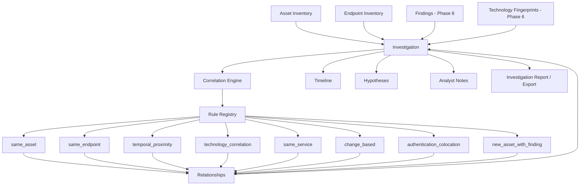

# Investigation & Incident Correlation (Phase 9)

Phase 9 gives an analyst a place to work: an Investigation that pulls
together findings (Phase 8), assets/endpoints (Phase 2/7), and technology
fingerprints (Phase 6) already collected, correlates them with explainable
signals, and tracks the analyst's own case-management activity — notes,
hypotheses, lifecycle — on an append-only timeline. It is an analytical
aid, never an offensive tool and never an automatic-remediation system.

## 1. Investigation Model



An `Investigation` (`internal/domain/investigation.Investigation`) is the
single case-management entity — see §2 for why phase9.md's separate
"Incident" concept is folded into it rather than duplicated. Its ID is a
fresh UUID assigned at creation, never a derived/deterministic identity
key: investigations are analyst-controlled and must never unexpectedly
merge (phase9.md §7).

## 2. Incident Model

phase9.md §3 describes an "Incident" whose fields
(Severity/Confidence/Status/DetectedAt/FirstObservedAt/LastObservedAt) are
almost a strict subset of Investigation's own (§2). Rather than introduce
a second, nearly-identical table, `Investigation` carries every field
either section asks for — the same consolidation phase9.md §54 explicitly
sanctions ("do not create duplicate endpoints if incidents are
intentionally represented as investigations"). `DetectedAt`/
`FirstObservedAt`/`LastObservedAt` are set only from real evidence
timestamps (never fabricated) and widen automatically as evidence is
attached (`Repository.UpdateFirstLastObserved`).

## 3. Finding Relationships

Findings attach to an investigation via `EvidenceRef`
(`source_type = finding`), carrying an explicit `RelationType`
(`related`/`correlated`/`suspected`/`confirmed` — phase9.md §4) rather than
a bare boolean. Attaching a finding also materializes its own real history
(`finding_created` at its `FirstSeen`, and any `finding_resolved`/
`finding_reopened` transitions it already has) onto the investigation's
timeline, using the finding's own timestamps — never the time of
attachment (phase9.md §11/§50).

## 4. Timeline

`TimelineEvent` rows are always scoped to one investigation. Two sources
populate it: real observations (asset/endpoint/finding timestamps,
materialized on attachment) and the investigation's own audit trail
(created/updated/status-changed/note-added/hypothesis-created/
relationship-created — phase9.md §61). A second, separate audit-log table
was deliberately not introduced: the timeline's own event vocabulary
already covers every audit action §61 lists, and splitting them would
only create two sources of truth for "what happened to this
investigation and when." Chronological by default; `--newest-first`
reverses it. Timestamps are never fabricated (phase9.md §11).

## 5. Correlation Engine

`internal/investigation` is a self-contained engine (no database
dependency), mirroring `internal/detection`'s split exactly:
`Rule`/`Registry`/`Engine` here play the same role
`Detector`/`Registry`/`Engine` do there. `Engine.Correlate` builds an
`Input` (already-persisted findings + their sibling assets/endpoints/
technology fingerprints, assembled by `internal/service/investigation`),
runs every enabled rule with per-rule error isolation (phase9.md §78: one
rule failing never aborts the run), and merges same-key results.

## 6. Correlation Rules

`internal/investigation/correlation` implements 8 rules across 8 files,
covering every relationship type phase9.md's Definition of Done requires
plus two domain-specific refinements:

| Rule ID | File | Score | Notes |
|---|---|---|---|
| `same_asset_findings` | asset.go | 30 | phase9.md §17 |
| `same_endpoint_findings` | endpoint.go | 30 | phase9.md §18 |
| `temporal_proximity` | temporal.go | 20 | configurable window, phase9.md §16 |
| `technology_correlation` | technology.go | 10 | finding↔technology, phase9.md §19 |
| `same_service` | network.go | 15 | shared IP — deliberately weak, phase9.md §39 |
| `endpoint_change_with_finding` | finding.go | 25 | phase9.md §20 |
| `authentication_colocation` | authentication.go | 15 | domain refinement of same-asset |
| `new_asset_with_finding` | exposure.go | 20 | finding↔asset, phase9.md §21 |

Every rule's `Evaluate` returns a `Relationship` carrying `Score`,
`Signals` (a `map[string]int` naming each contributing signal — never an
opaque number, phase9.md §38), and a human-readable `Explanation` that
states only what was observed, never a maliciousness claim
(`TestTechnologyRule_NeverClaimsExploitation`,
`TestSameServiceRule_AloneNeverCrossesDefaultThreshold`,
`TestTemporalProximityRule_AloneBelowDefaultThreshold` all verify this
directly).

## 7. Correlation Scoring

`Score` is a plain signal sum (phase9.md §36's worked example:
same_asset +30, same_endpoint +30, temporal_proximity +20, ...) — never
called a probability. `ConfidenceForScore` buckets it into the same
five-level vocabulary (`very_low`…`very_high`) used elsewhere, in one
documented place rather than re-derived per rule.

## 8. Explainability

Every `Relationship` (engine-side and persisted) carries `Explanation`
and `Signals` — `"Both findings affect the same asset (example.test)."`,
never `"related: true"` (phase9.md §35). `internal/domain/investigation.
Relationship.Validate` enforces a non-empty `Explanation` at the
persistence boundary, so this is structurally impossible to violate.

## 9. Incident Clusters

`SuggestClusters` groups a target's currently-open findings by shared
asset (≥2 findings) into `IncidentCluster` rows, `status = suggested` —
never auto-created as an Investigation (phase9.md §40). An analyst
explicitly `Accept`s (converting the cluster into a real Investigation
and attaching every clustered item) or `Reject`s it (preserved, never
deleted — phase9.md §42).

## 10. Hypotheses

A `Hypothesis` is an analyst's stated, falsifiable theory
(`proposed → investigating → supported/unsupported/confirmed/rejected`),
independent of the parent investigation's own status. Every
`HypothesisEvidence` row requires a non-empty `Description` — the system
never represents speculation as fact (phase9.md §25).

## 11. Evidence Provenance

`EvidenceRef` never copies evidence content — only `source_type`,
`source_id`, `observed_at` (from the source's own real timestamp),
`added_at`, and `added_by` (phase9.md §34's "evidence chain"). Because it
is a reference, an investigation's evidence list reflects the
underlying finding/asset's current state on every read, never a stale
snapshot.

## 12. Audit Trail

Every mutation phase9.md §61 lists (created, severity/priority/
assignment/status changed, finding/evidence attached, note added,
hypothesis created, relationship created, closed, reopened) produces a
`TimelineEvent` — see §4 above for why this doubles as the audit trail
rather than a separate table.

## 13. Authorization

Investigation operations reuse Phase 2's `TargetService`/`AssetService`
directly — no second authorization mechanism. Safe-active Phase 8
detection already gates on `Target.IsAuthorized()`; Phase 9's correlation
is purely read-only over already-persisted data and performs no network
request of its own, so it carries no additional authorization
requirement beyond loading a valid target.

## 14. Redaction

Findings' `Metadata`/evidence are already sanitized by Phase 8's
`SanitizeMetadata` boundary before Phase 9 ever reads them. Every Phase 9
domain type (`Investigation`, `Note`, `Hypothesis`, `TimelineEvent`,
`Relationship`) carries no credential-shaped field at all — there is
nothing to redact because nothing sensitive is ever accepted into these
structures in the first place; `TestExport_NeverIncludesSecretFields`
verifies this structurally for exports.

## 15. CLI

```sh
ai-recon investigate create --target example.com --title "Suspicious API Surface Change" --created-by analyst1
ai-recon investigate list --target example.com
ai-recon investigate show <id>
ai-recon investigate timeline <id> [--newest-first]
ai-recon investigate correlate <id> [--dry-run]
ai-recon investigate findings <id>
ai-recon investigate attach <id> --finding <finding-id> --relation correlated --actor analyst1
ai-recon investigate note <id> --content "..." --author analyst1
ai-recon investigate hypothesis <id> --title "..." --created-by analyst1
ai-recon investigate close <id> --actor analyst1 --reason "..."
ai-recon investigate reopen <id> --actor analyst1 --reason "new evidence surfaced"
ai-recon investigate export <id> --format json|csv|markdown
ai-recon investigate cluster suggest --target example.com
ai-recon investigate cluster accept <cluster-id> --actor analyst1
```

## 16. API

No REST API exists for any resource in this project yet (Phase 1's
`internal/httpserver` only exposes `/health`/`/ready`) — Phase 9 adds
none either, consistent with every prior phase's decision. The service
layer (`internal/service/investigation.Service`) is already the shape a
future API would call directly.

## 17. Export

`ai-recon investigate export <id> --format json|csv|markdown` renders an
`ExportBundle` (findings, evidence references, timeline, relationships,
hypotheses, notes) built entirely from already-persisted rows. Markdown
follows phase9.md §85's exact section structure (Executive Summary,
Scope, Findings, Timeline, Correlations, Hypotheses, Analyst Notes,
Current Status).

## 18. Graph Representation

Relationships already form a graph (`source_type/source_id` →
`target_type/target_id`, typed and scored) without a graph database —
PostgreSQL relational tables remain the store, per phase9.md §22's
explicit instruction. `Relationship.Status` (`candidate`/`confirmed`)
distinguishes an automatically-scored, possibly-wrong inference from a
score that cleared the configured threshold; nothing in this schema ever
claims a `same_asset`/`temporal_proximity`/etc. edge is an *observed*
fact the way "this finding affects this endpoint" is (phase9.md §84's
observed-vs-inferred distinction).

## 19. AI-Ready Architecture

No LLM is integrated in Phase 9 (phase9.md §47 explicitly prohibits it).
`Service.Summarize` and `Service.BuildExportBundle` already assemble
exactly the structured context (`InvestigationContext`-shaped: asset/
endpoint metadata, findings, timeline, relationships, evidence, notes,
hypotheses) a future AI-assistance phase would need, without requiring
any architectural change to produce it.

## 20. Security Boundaries

No exploit chains, payload generation, credential attacks, brute force,
persistence, lateral movement, command execution, privilege escalation,
stealth, or evasion exist anywhere in this package (phase9.md §88). No
automatic remediation (blocking IPs, disabling accounts, modifying
firewall/DNS/servers, deleting files) exists either (phase9.md §89). No
attacker attribution (identity, threat actor, nationality, organization,
motive) is ever inferred (phase9.md §87) — nothing in this platform's
data model carries that information to infer from in the first place.

## 21. Known Limitations

- Optimistic concurrency (`Investigation.Version`) is enforced at the
  repository layer, but the CLI's close/reopen commands auto-fetch the
  current version immediately before updating rather than requiring the
  caller to track it explicitly — a reasonable simplification for a
  single-operator CLI tool, not a concurrent multi-analyst API (a future
  API layer would expose `Version` to the caller directly).
- `SuggestClusters` groups by shared asset only; it does not currently
  exclude findings that are already attached to another open
  investigation, so the same finding can appear in more than one
  suggested cluster. Accepting a cluster is always an explicit,
  reversible-by-rejection action, so this does not risk silent
  duplication of real investigations.
- Pairwise correlation rules (same_asset, same_endpoint, temporal,
  same_service, authentication_colocation) are O(n²) in the number of
  findings attached to one investigation. Benchmarked at 1,000
  synthetic findings (`internal/investigation/correlation.
  BenchmarkFullRegistry_1000Findings`) rather than the 10,000-finding
  scale phase9.md §76 mentions — this is an honest, real trade-off worth
  revisiting (e.g. bucketing by asset before the pairwise scan) if an
  investigation routinely accumulates that many findings.
- No REST API — none exists anywhere in this project yet.
