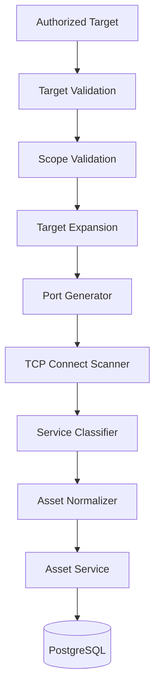

# Phase 4 Architecture: Network Discovery Engine

This document describes the TCP connect discovery engine built in Phase 4 —
the platform's second real reconnaissance capability, alongside Phase 3's
HTTP discovery. It does not describe OS fingerprinting, SYN/raw-packet
scanning, DNS/subdomain enumeration, or vulnerability probing, none of
which exist yet and none of which this phase implements (phase4.md §2/§49/
§50).

## Network discovery architecture



Package map:

```text
internal/discovery/
├── network/    the engine — config, scope (address-membership), target
│                expansion, port parsing, TCP connect scanning, service/AI
│                candidate classification
└── service/    discovery.go (Phase 3, HTTP) and network.go (Phase 4) —
                 the SAME orchestrator: authorization + scope + persist

cmd/cli/commands/network_scan.go   `ai-surface network-scan`
test/fixtures/tcp/                 local, fully offline generic TCP fixture
test/fixtures/localenv/            starts the full local test environment
```

**Phase 4 integrates into Phase 3's discovery architecture rather than
duplicating it** (phase4.md §3): `internal/discovery/service.Service` — the
same struct `NewScanCommand` already uses for HTTP discovery — gained one
new method, `RunNetwork`, in a new file (`network.go`) alongside the
existing `discovery.go`. No second orchestrator, no second `TargetService`/
`AssetService` wiring, no second database connection.

## Target handling

Network discovery accepts `HOST`, `IP`, and `CIDR` targets (phase4.md
§10) — `DOMAIN` and `URL` targets (Phase 3's territory) are rejected before
any expansion or connection attempt. This is deliberate: resolving a
domain to IPs is a DNS operation, and Phase 4 does not perform DNS
resolution or turn network scanning into subdomain discovery. A `HOST`
target's value is passed to `net.Dialer` as-is (the OS resolver handles
it, same as any other Go program dialing a hostname) without this package
doing any resolution itself.

`internal/discovery/network.ExpandTarget` turns a target into the concrete
addresses to scan:

- **HOST / IP**: the value itself, unchanged — a single-element result.
- **CIDR**: every *usable* host address, in ascending order. "Usable"
  follows the standard subnetting convention: for an IPv4 block with room
  for 4+ addresses (prefix ≤ /30), the network and broadcast addresses are
  excluded; `/31` (point-to-point, RFC 3021) and `/32` (single host)
  include every address, since there is no network/broadcast to exclude.
  `192.168.1.0/30` → `{.1, .2}`; `10.0.0.0/31` → `{.0, .1}`;
  `10.0.0.5/32` → `{.5}`.

`MaxHosts` (`discovery.network.max_hosts`, default 256) bounds CIDR
expansion — exceeding it is an outright error ("network target exceeds
configured host limit"), never a silent truncation, and no expansion or
connection is attempted (phase4.md §11).

## Authorization

`Service.RunNetwork` loads the target, validates it, and checks
`Target.IsAuthorized()` — **before generating a single host address or
sending a single TCP connection** — exactly the same discipline Phase 3
established for HTTP discovery, reusing the identical `TargetService`/
`Target.IsAuthorized()` call. An unauthorized target fails immediately with
"target is not authorized for active discovery"; `ai-surface target
authorize` (Phase 3's CLI command) is the only way a target becomes
`AUTHORIZED` — Phase 4 adds no second authorization mechanism.

## Scope enforcement

Every generated host is checked against scope before it is even offered to
the scanner (defense in depth), and the scanner re-checks every host
immediately before each connection attempt (the real enforcement boundary)
— never assumed from expansion alone (phase4.md §13).

**Scope validation here is intentionally a different mechanism than Phase
3's `internal/discovery/http.ScopeValidator`** (hostname/subdomain
matching), not a reuse of that exact type — reusing it would have been
semantically *wrong*, not just architecturally inconvenient: an IP address
has no "subdomain" relationship to another IP, and a CIDR block like
`192.168.1.0/30` doesn't parse as a hostname at all. `network.ScopeChecker`
expresses the same authorization *principle* (approved membership, checked
before every connection) correctly for address targets instead:

- `HOST`/`IP` target: a candidate is in scope only if it exactly equals
  the target's value.
- `CIDR` target: a candidate is in scope only if it is a member address of
  that CIDR block (`netip.Prefix.Contains`).

## Port parsing

`internal/discovery/network.ParsePorts` accepts single ports (`80`),
comma-separated lists (`80,443`), inclusive ranges (`8000-8010`), and
mixed combinations (`80,443,8000-8010,11434`). Output is always
deduplicated and sorted — `80,80,443,8000-8002,8001` produces exactly
`[80, 443, 8000, 8001, 8002]` (phase4.md §8's own example). Malformed
input is rejected outright, never silently corrected: port `0`, negative
values, values above 65535, non-numeric tokens, empty values, and reversed
ranges (`8000-7000` — "start port must not exceed end port") all produce a
descriptive error naming the offending token (phase4.md §9).

## TCP connect scanning

`internal/discovery/network.Scanner` uses only `net.Dialer.DialContext` —
Go's standard connect-oriented networking, no raw sockets, no privileged
access required (phase4.md §49). Every attempt classifies into one of four
states:

- **OPEN** — the TCP handshake completed.
- **CLOSED** — the connection was actively refused (`ECONNREFUSED`):
  informative, not a failure — nothing is listening there.
- **TIMEOUT** — the connect deadline (or context) was exceeded. This is
  never relabeled `FILTERED`: a bare TCP timeout cannot establish firewall
  semantics on its own, and this project does not claim evidence it
  doesn't have (phase4.md §14/§20).
- **ERROR** — anything else (network unreachable, unexpected dial
  failure, ...).

## Concurrency

`Scan` bounds concurrency with a buffered channel semaphore sized to
`discovery.network.max_concurrency` (default 100) — never one goroutine
per host×port pair unbounded. Every goroutine also selects on `ctx.Done()`
both while acquiring the semaphore and immediately after, and `Scan` joins
every goroutine with a `sync.WaitGroup` before returning — the same
leak-free guarantee `internal/discovery/http.Scanner.Scan` documents
(phase4.md §16/§17/§41). `go test -race ./...` passes across the whole
repository.

An optional rate limiter (`discovery.network.requests_per_second`, default
`0` = unlimited) paces attempts with a fixed-interval `time.Ticker` shared
across every worker goroutine — a safety/stability control for sensitive
targets, not stealth timing: it is never randomized (phase4.md §18/§50).

## Timeout handling

Every connection attempt has a bounded deadline —
`discovery.network.connect_timeout` (default 2s) — applied via
`context.WithTimeout` wrapping the scan's own context, so it composes
correctly with both cancellation and the per-scan context Ctrl+C cancels.
There is no unlimited-timeout code path.

## Service classification

`internal/discovery/network.classifyPort` is a conservative, **port-number-only**
heuristic — `UNKNOWN`, `HTTP`, `HTTPS`, `SSH`, `FTP`, `SMTP`, `DNS`,
`DATABASE`, `TLS_SERVICE`, `OTHER` — explicitly never presented as
definitive proof (phase4.md §21). No protocol payload is ever sent to an
unclassified/unknown service to probe further (phase4.md §22). The one
exception: for a port already classified `HTTPS`/`TLS_SERVICE`, the
scanner attempts a bounded, metadata-only TLS handshake (no application
data — just the handshake itself, which is required to observe that TLS
is even present) to capture safe metadata (TLS version, cipher suite,
certificate CommonName subject/issuer, expiry) — the same restraint
`internal/httpclient.TLSMetadata` applies: no certificate chains, no key
material. A failed handshake is not an error; the port is still reported
OPEN, just without TLS metadata.

HTTP/HTTPS identification deliberately does **not** duplicate Phase 3's
HTTP discovery (phase4.md §22/§23): an open port on a configured
`http_candidate_ports` port (default `80, 443, 8000, 8080, 8443`) is
flagged `HTTPCandidate = true` — "worth a Phase 3 HTTP discovery pass" —
never a confirmed HTTP service. Phase 4 does not call Phase 3's scanner
inline; that composition is left to a future orchestration phase (or an
operator manually running `ai-surface scan` next).

## AI candidate detection

Analogous to `HTTPCandidate`: an open port on a configured
`ai_candidate_ports` port (default `11434, 5000, 8000, 8080, 8888`) is
flagged `AIServiceCandidate = true` with `CandidateReason =
"configured_ai_port"` — **only** "worth further HTTP/fingerprinting
analysis", never "confirmed AI service" (phase4.md §24). A reachable port
is never treated as proof by itself; `TestAIServiceCandidate_
OrdinaryPortNotInherentlyAI` asserts port 80 (not on any default AI list)
is never flagged. The CLI table output distinguishes a candidate from a
confirmed classification in its own `CANDIDATE` column, never conflating
the two (phase4.md §32).

## Asset normalization

`Service.persistPort` (in `internal/discovery/service/network.go`) maps a
`PortResult` onto Phase 2's `asset.Input`: `Type = PORT` (phase4.md §25),
`Hostname`/`Port`/`Protocol = "tcp"` from the observation, `Technology`
set to the classified service name when it's not `UNKNOWN`, `Source =
"network"` (distinct from HTTP discovery's `"http"`, so the two are always
attributable even when they describe the same real endpoint — see
Multi-source below), `Confidence = 0.7` — lower than HTTP discovery's 0.9,
since a bare TCP connect confirms reachability but not that any
application is meaningfully serving content there. **Only OPEN ports are
persisted** — CLOSED/TIMEOUT/ERROR results appear in the CLI output and
`Summary` but create no asset row (nothing to represent).

## Asset identity

No second identity system exists (phase4.md §26): identity is computed
entirely by Phase 2's existing `asset.Identity`, whose `PORT`/`SERVICE`
handling already uses `host + port + protocol` — exactly what this phase
needs, unmodified. Re-scanning the same host:port always resolves to the
same asset row via `AssetService.RecordObservation`'s existing upsert
semantics: `FirstSeen` is preserved, `LastSeen` advances, and metadata
shallow-merges — the identical behavior Phase 2/3 already established and
tested.

## Evidence

Each persisted OPEN port also records one `PORT_OBSERVATION` evidence
entry (`AssetService.RecordObservation`, atomic with the asset upsert) —
host, port, protocol, state, duration, service, HTTP/AI candidate flags,
TLS metadata when captured. **Evidence data deliberately excludes
`scan_id`** — the asset/endpoint `Metadata` does include it, but Phase 2's
evidence deduplication fingerprints the evidence-data map, and `scan_id`
is unique to every run by design; including it there would make every
re-scan of an unchanged port create a new evidence row forever. This exact
bug was found and fixed during Phase 3's manual verification (see
`docs/architecture/http-discovery.md`); Phase 4 applies the fix from the
start rather than rediscovering it, and this session's own manual
verification (re-scanning a fixture port and inspecting
`asset_evidence` directly) confirmed evidence stays at one row across
repeated scans of unchanged content.

## CLI usage

```sh
ai-surface target create --name "local test" --type IP --value 127.0.0.1
ai-surface target authorize --id <uuid>
go run ./test/fixtures/localenv                 # starts :8000, :8080 (HTTP), :9000 (TCP)
ai-surface network-scan --target 127.0.0.1 --ports 8000,8080,9000 --format table
ai-surface network-scan --target 127.0.0.1 --profile quick --format json
ai-surface network-scan --target 192.168.1.0/30 --ports 22,80,443 --dry-run
```

Flags: `--target` (required), `--target-type` (auto-detected: contains
`/` → `CIDR`, else a valid IP literal → `IP`, else `HOST`), `--ports`
(single/list/range/mixed) or `--profile` (exactly one of the two is
required), `--format` (`table`/`json`), `--timeout`, `--concurrency`,
`--rate`, `--dry-run`. Operational logs always go to stderr, so `--format
json`'s stdout is always valid, log-free JSON.

## Profiles

`discovery.network.profiles` (`quick`, `standard`, `comprehensive` by
default) are entirely data — named port lists in configuration, never
hard-coded in Go (phase4.md §34). `comprehensive` is a deliberately bounded
list of common service/database/AI ports (36 ports), never `0-65535`
(phase4.md §6) — that would require an explicit, very large `--ports`
value and remains the operator's choice, not this phase's default
behavior.

## Dry-run

When `security.dry_run` is `true` (or `--dry-run` is passed),
`Service.RunNetwork` expands the target and resolves ports but never
constructs a `Scanner` or opens any TCP connection — no connection is
made, and nothing is persisted (phase4.md §19). `ai-surface network-scan
--dry-run` prints exactly the `host:port` pairs that would have been
attempted.

## Failure handling

`internal/discovery/network.Scanner` isolates every host:port pair's
outcome — a `CLOSED`/`TIMEOUT`/`ERROR` result never aborts the scan, and
`Service.RunNetwork` applies the same isolation one layer up: a
persistence failure for one OPEN port is logged and does not abort the
rest of the run (phase4.md §46). Configuration errors (invalid port
specification, unsupported target type, CIDR exceeding `max_hosts`) are
rejected before any network activity, distinctly from a per-port runtime
failure.

## Security boundaries

- No SYN/raw-socket/privileged scanning — the default (and only) scanner
  is `net.Dialer`-based TCP connect, runnable without root (phase4.md
  §49). If a privileged scanner is ever needed, it belongs behind a
  future `PortScanner` abstraction boundary this phase deliberately does
  not build yet.
- No proxy/IP rotation, no randomized timing, no TLS fingerprint evasion,
  no IDS/firewall evasion (phase4.md §50). Rate limiting exists solely for
  target stability/safety, using a fixed interval.
- No credentials are guessed, no arbitrary protocol payload is sent to an
  unknown service (phase4.md §22).
- Never logged: credentials, tokens, cookies, private keys, authorization
  headers (phase4.md §45) — network logging is metadata-only (host, port,
  protocol, state, duration, service).
- No certificate chains or key material are ever captured or stored — TLS
  metadata is limited to version/cipher/CommonName/expiry, the same
  restraint `internal/httpclient` already applies.
