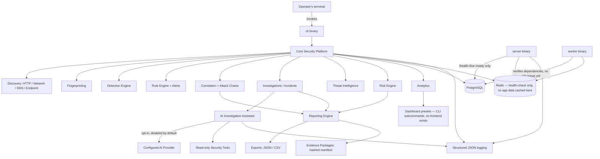

# Architecture Overview (Phase 15)

This is the whole-system view after Phase 15's hardening pass. Every
per-engine detail already has its own document under `docs/architecture/`
(one per phase, e.g. `docs/architecture/detection-engine.md`); this page
is the map of how they all fit together, adapted from the master
specification's template to what this codebase actually is.

## What this platform actually is

`ai-recon-platform` is a **CLI-driven** security reconnaissance,
detection, correlation, investigation, and reporting toolkit with a thin
HTTP surface (`/health`, `/live`, `/ready` only — no REST API for any
security-platform resource exists). There is no frontend, no job queue
consuming real work yet, and no authentication/RBAC layer — see
`docs/security/threat-model.md` for what that does and doesn't mean for
security. Every diagram element below that the master specification names
but this codebase doesn't have is marked accordingly, not silently
invented.



## Components

| Layer | Package(s) | Notes |
| --- | --- | --- |
| Frontend | *(none exists)* | Every interaction is via `cli`; `docs/analytics/dashboards.md` maps each "dashboard" concept to a CLI command instead. |
| API | `internal/httpserver` | 3 endpoints only: `/health`, `/live`, `/ready`. No resource API. |
| Database | `internal/database`, `internal/repository/*` | PostgreSQL via pgx; every query parameterized (see `docs/security/production-hardening.md`). |
| Workers | `cmd/worker` | Verifies dependencies on a timer; no job queue consumed yet (documented limitation since Phase 1). |
| Queue | *(none exists)* | Redis is provisioned but used only for health-checking today. |
| Cache | `internal/analytics.Cache` | The only in-process cache in this codebase — bounded TTL, target-scoped (see `docs/analytics/dashboards.md`). |
| Ingestion | `internal/discovery/*` | HTTP/Network/DNS/Endpoint discovery engines (Phases 3–7). |
| Detection | `internal/detection`, `internal/ruleengine` | Passive/safe-active finding detection (Phase 8) + the rule/alert engine (Phase 11). |
| Correlation | `internal/correlation`, `internal/investigation` | Cross-finding correlation and attack-chain analysis (Phase 12) feeding investigations (Phase 9). |
| Investigation | `internal/investigation`, `internal/service/investigation` | Investigation/incident lifecycle and timeline (Phase 9). |
| Intelligence | `internal/intelligence` | Threat intel enrichment + risk scoring (Phase 10). |
| AI | `internal/ai`, `internal/service/ai` | Investigation copilot (Phase 13) — opt-in, disabled by default, no core pipeline depends on it. |
| Analytics | `internal/analytics`, `internal/repository/analytics` | Aggregate metrics/dashboards (Phase 14). |
| Reporting | `internal/reporting`, `internal/service/reporting` | Versioned, citation-validated reports + evidence packages + compliance evidence (Phase 14). |
| Evidence | `internal/domain/reporting` (`Package`/`Item`), `internal/repository/reporting` | Hashed manifests referencing existing evidence, never copying it. |
| Observability | `internal/logging`, `internal/httpserver` request IDs | Structured JSON logs only — no metrics/tracing library exists. |

## Security boundary diagram

```
Internet
  │
  ▼
[ Reverse proxy — TLS termination, not part of this codebase ]
  │
  ▼
[ cmd/server — /health /live /ready only ]   ◄── semi-trusted: reachable from wherever the proxy allows
  │
  ▼
[ cmd/cli / cmd/worker / cmd/migrate ]        ◄── trusted: run by the operator directly, full DB access
  │
  ▼
[ PostgreSQL ]  [ Redis ]                      ◄── trusted: never exposed publicly (see below)
```

- **Trusted**: the operator's own terminal/CI runner, the binaries
  themselves, PostgreSQL, Redis.
- **Semi-trusted**: `cmd/server`'s three health endpoints, if placed
  behind a reverse proxy reachable from a wider network than the
  operator's own machine — they expose no sensitive data (status only)
  but should still not be placed on the open internet without a reason.
- **Untrusted**: every assessed target; any configured AI/threat-feed
  provider's *content* (not the operator's decision to use it — see
  `docs/security/threat-model.md`).

**Recommended segmentation**: PostgreSQL and Redis should never be
reachable from outside the network segment `cmd/server`/`cmd/worker`/
`cmd/cli` run in — there is no separate "frontend" segment to speak of
since none exists, but if a reverse proxy fronts `cmd/server`, it belongs
in its own segment with only outbound access to `cmd/server`'s port.

## What's deliberately not in this diagram

- A frontend/browser tier for the actual security-platform functionality
  — none exists; see `docs/analytics/dashboards.md`.
- A message queue between `cmd/server` and `cmd/worker` — none exists;
  `cmd/worker` does not consume work from `cmd/server` today.
- A metrics/tracing sidecar — no Prometheus/OpenTelemetry dependency
  exists in `go.mod`; see `docs/operations/runbook.md`'s Observability
  section for what signal is actually available (structured logs only).
