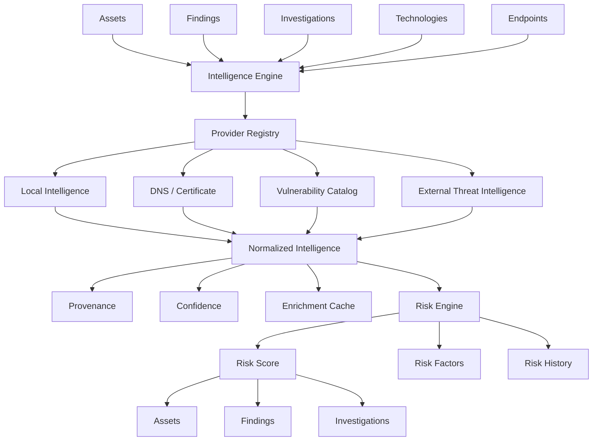

# Threat Intelligence & Risk Enrichment Engine

Phase 10 answers two questions on top of everything Phase 2-9 already
collected: *"what additional context do we know about this asset or
finding?"* and *"how should this information affect the security risk
picture?"* — see [risk-model-v1.md](../security/risk-model-v1.md) for the
risk-scoring formula itself.

## 1. Intelligence Architecture

Mirroring `internal/detection` and `internal/investigation`'s split
(phase8.md §1/phase9.md §1):

- `internal/domain/intelligence` — the *persisted* representation
  (`IntelligenceRecord`, `VulnerabilityRecord`/`VulnerabilityMatch`,
  `RiskScore`, `EnrichmentEvent`, `AssetCriticality`). Zero database
  dependency; never imports `internal/domain/asset`,
  `internal/domain/finding`, or `internal/domain/investigation`
  (cross-entity references are a bare `uuid.UUID`).
- `internal/intelligence` — the self-contained engine (`Provider`,
  `Registry`, `Engine`, indicator normalization, aggregation,
  vulnerability matching). Zero database dependency; defines its own
  mirrored types (`Record`, not `domainintelligence.IntelligenceRecord`)
  the same way `internal/detection.Finding` mirrors
  `internal/domain/finding.Finding` rather than importing it.
- `internal/intelligence/providers` — `Provider` implementations.
- `internal/intelligence/risk` — the risk-scoring model, equally
  self-contained.
- `internal/repository/intelligence` — persistence. Never imports
  `internal/intelligence` (the engine) — see §5's cache note.
- `internal/service/intelligence` — the bridge: resolves configuration,
  assembles a `providers.LocalDataset` from already-persisted Phase 2/5/6
  data, calls `Engine.Lookup`, evaluates vulnerability matches and risk,
  and persists the result.



No REST API layer exists for this (or any prior) phase — the CLI
(`ai-surface intel`/`ai-surface risk`) is the primary interface, consistent
with every phase since Phase 2; see §18.

## 2. Provider Interface

```go
type Provider interface {
    ID() string
    Name() string
    Version() string
    Capabilities() []Capability
    Lookup(ctx context.Context, indicator Indicator) ([]Record, error)
}
```

A `Provider` never fetches its own input data from the database — Local/
DNS/Certificate/Technology providers read from a `providers.LocalDataset`
assembled by `internal/service/intelligence` (the "engine never touches
the database" discipline every prior phase's engine follows). Because one
`Registry`/`Engine` pair is built once per CLI invocation but must serve
many different indicators/assets within that one run,
`providers.DatasetSource` is a small mutable holder those four providers
share — the service calls `Set` before every lookup that needs local
data. This is documented as safe only for this project's
single-invocation-per-process CLI model; see §20.

## 3. Provider Registry

`intelligence.Registry` mirrors `detection.Registry` exactly:
`Register`/`Get`/`All`/`SetEnabled`/`Enabled`/`Active`/`Metadata`, plus
health tracking (`RecordSuccess`/`RecordFailure`/`Health`) bucketing a
provider into `healthy`/`degraded`/`unavailable` after 1/3 consecutive
failures. Health is in-process only — see §20's Known Limitations.

## 4. Indicator Model

`IndicatorType`: `domain`, `subdomain`, `ipv4`, `ipv6`, `url`, `hostname`,
`certificate`, `technology`, `hash` — a closed set (phase10.md §2).
`Indicator{Type, Value}` is the unit every provider looks up and every
cache entry keys on.

## 5. Provenance

Every `Record` carries `ProviderID`/`ProviderVersion` (so a historical
record stays interpretable even after a provider's behavior changes —
phase10.md §6), `SourceType`, `RetrievedAt`, and `SourceReference`. The
persistent cache (`internal/repository/intelligence`'s `intelligence_cache`
table) deals only in raw JSON bytes, never the engine's `Record` type —
`internal/service/intelligence`'s `postgresCache` adapter is the one place
that crosses the engine/repository boundary for caching, so
`internal/repository/intelligence` itself has no dependency on
`internal/intelligence` (mirroring `internal/repository/finding` having
none on `internal/detection`).

## 6. Normalization

`Normalize(Indicator)` canonicalizes per type: domains/hostnames
lowercased and trimmed (trailing dot removed), IPs via `net.ParseIP`'s
canonical form, URLs with the scheme/host lowercased and a default port
stripped — path, query, and any non-default port are preserved
(phase10.md §56: never destroy a meaningful distinction). `Normalize` is
idempotent.

## 7. Caching

`intelligence.Cache` is an interface (`Get`/`Set`/`Invalidate`) keyed by
`(ProviderID, IndicatorType, IndicatorValue)`. `MemoryCache` is the
in-process default (tests, and any run with no persistent cache wired);
`internal/service/intelligence`'s `postgresCache` is the real, persistent
implementation backed by the `intelligence_cache` table — reusing this
platform's existing database rather than standing up new caching
infrastructure (phase10.md §1; `internal/redis` is a bare connectivity
client with no cache abstraction of its own). TTLs default to 24h for
reputation-shaped providers and 7 days for the vulnerability-matching
provider (`Engine.ttlFor`), both configurable via
`intelligence.reputation_ttl`/`vulnerability_ttl`. `ai-surface intel
refresh` calls `Cache.Invalidate` for every active provider before
re-enriching (phase10.md §24).

## 8. Reputation

Every `Record` carries a `Verdict` (`benign`/`suspicious`/`malicious`/
`unknown`) and a leveled `Confidence` (`low`/`medium`/`high`/`unknown` —
deliberately not a float; phase10.md §55 explicitly warns against
pretending unwarranted statistical calibration). `Aggregate(records,
weights)` combines every record for one indicator into an
`AggregatedResult`: the headline verdict is the highest-*weighted*-vote
verdict among `benign`/`suspicious`/`malicious`, ties broken toward the
LESS severe verdict (a 1-vs-1 tie never headlines "malicious" —
phase10.md §98). `SupportingSources`/`ConflictingSources` and every
individual `Record` are preserved — disagreement is never hidden
(phase10.md §19/§54). The engine's `Record`/`AggregatedResult` (and the
Local/DNS/Certificate providers) always report `VerdictUnknown`: this
platform has no external reputation database of its own, and inferring a
verdict from local observations alone would be exactly the unsupported
threat inference phase10.md §101 prohibits — only the opt-in external
`ThreatFeedProvider` can report a non-unknown verdict.

## 9. Vulnerability Matching

`Matcher.Evaluate(TechnologyObservation)` compares an observed
`(Product, Vendor, Version)` against every `CatalogEntry` sharing its
product, producing a `Match` with an explicit `MatchStatus`:

| Status | Meaning |
| --- | --- |
| `confirmed` | Exact-precision version evidence satisfies every constraint |
| `probable` | Evidence satisfies the constraint but at lower precision, or the observed version string couldn't be fully parsed |
| `insufficient_evidence` | No version evidence exists — product name alone is **never** a match (phase10.md §15) |
| `no_match` | Version evidence exists and does NOT satisfy the constraints |

Version comparison is a small self-contained dotted-numeric comparator
(`internal/intelligence/vulnerability.go`), not a semver library — this
project adds no new third-party dependency without a concrete need (see
`go.mod`), and real technology fingerprint version strings ("1.18.0",
"8.1") aren't reliably strict semver. Every `Match` carries `Evidence`
(what was compared) and `MatchingRule` (which comparison fired) — the
matching logic is never hidden (phase10.md §16). The built-in catalog
ships **empty** — see §20.

## 10. Risk Model

See [risk-model-v1.md](../security/risk-model-v1.md) for the full,
reproducible formula. In one sentence: `risk.Scorer.Calculate(Input)`
sums documented, fixed per-factor point values (finding severity,
exposure, vulnerability match status, intelligence verdict, asset
criticality, recent change), clamps to `[0, 100]`, and returns every
contributing `Factor` alongside the score — a risk score is a combined
security-context signal, never a claim of confirmed vulnerability
(phase10.md §35).

## 11. Risk Scoring

`internal/service/intelligence.EnrichAsset` assembles a `risk.Input` from
already-persisted data only: the highest-severity open finding on the
asset, exposure signals (internet-facing, endpoint classification counts
from Phase 7), the strongest vulnerability match status (§9), the
aggregated intelligence verdict (§8), the asset's analyst-set criticality
(§12), and whether the asset changed within the last 7 days. `EnrichFinding`
reuses this but overrides the finding-severity factor with the specific
finding under enrichment. `EnrichInvestigation` enriches every asset
attached to the investigation (directly or via an attached finding) and
takes the highest-scoring asset's factors as the investigation's own —
never inventing a higher score than any contributing asset's evidence
supports (phase10.md §39/§40).

## 12. Risk History

`risk_scores` is append-only — `CreateRiskScore` always inserts a new
row; recalculation never overwrites a previous score (phase10.md §45/
§46). `ai-surface risk asset <id> --history` lists every score ever
calculated for an entity, newest first, via a numeric-offset cursor (the
same "ordering isn't the keyset `(created_at, id)` every other listing
uses" exception `investigation_relationships`'s timeline listing already
established, reused here because `risk_scores` is ordered by
`calculated_at`). An `EventRiskScoreIncreased` `EnrichmentEvent` is
recorded whenever a new score exceeds the previous one.

Asset criticality (`AssetCriticality`) is analyst/business context — an
explicit action only, never inferred from a hostname or any other
observed signal (phase10.md §36): `ai-surface risk criticality set
<asset-id> --level high --set-by <analyst>`.

## 13. External Provider Policy

Three independent conditions must all be true before any network request
leaves this platform for a threat-feed lookup (phase10.md §30):

1. `intelligence.external.enabled: true` (project/deployment-level, default `false`)
2. `intelligence.providers.threat_feed` not explicitly disabled (default enabled, but inert until #1 and #3)
3. `intelligence.threat_feed.base_url`/`api_key_env` configured with a real environment variable holding the credential

`Engine.Lookup`/`Engine.Plan` filter out any provider whose
`Capabilities()` includes `CapabilityThreatFeed` unless
`Config.ExternalEnrichmentEnabled` is true — enforced in the engine
itself, not only in configuration, so a misconfigured caller can't
accidentally bypass it.

## 14. Privacy

`ai-surface intel enrich <indicator> --dry-run` reports exactly which
providers would run (`Engine.Plan`) and always "0 external requests" —
no lookup is performed. Local/DNS/Certificate/Technology providers only
ever look up indicators this platform already has an asset for (see §2);
`internal/service/intelligence.datasetForIndicator` resolves the asset
within the given target only, never pivoting into unrelated
infrastructure (phase10.md §31/§32).

## 15. Rate Limiting

`ThreatFeedProvider` paces its own requests with a local `rateLimiter`
(a `time.Ticker`-based token pace, mirroring every discovery engine's
identically-named helper in `internal/discovery/{dns,network,endpoint}`)
at `intelligence.threat_feed.requests_per_second`. On HTTP 429 it waits
once for the `Retry-After` duration (capped at 30s) before a single
retry — authentication failures (401/403) are never retried. Every
provider's `Engine.Config.ProviderTimeout` (default 10s) bounds the whole
call via `context.WithTimeout`, so no provider can block the pipeline
indefinitely (phase10.md §69).

## 16. Security

- No exploit, credential-attack, or brute-force code anywhere in this
  package (phase10.md §100).
- No automatic remediation: no IP/domain blocking, no firewall/DNS/
  infrastructure modification (phase10.md §99).
- No automatic threat attribution: `Category`/`Verdict` are only ever
  set from what a provider actually returned, never inferred
  (phase10.md §52/§101).
- API keys are read only from the environment variable named by
  `intelligence.threat_feed.api_key_env` — never hardcoded, logged, or
  stored in `NormalizedData`/`intelligence_records`/`intelligence_cache`
  (phase10.md §26/§67).
- External provider responses are treated as untrusted data
  (`feedResponse`'s unrecognized verdict/confidence strings fall back to
  `unknown` rather than being trusted verbatim) — never executed or
  rendered as HTML (phase10.md §68).

## 17. CLI

`ai-surface intel {lookup,enrich,refresh,providers,status,enrich-project}`
and `ai-surface risk {asset,finding,investigation,criticality}` — see the
README's Threat Intelligence & Risk Enrichment section for worked
examples. `intel lookup` is read-only (never queries a provider); `intel
enrich` is the active operation; `intel enrich-project` bounds batch
enrichment to `--limit` assets (default 50 — phase10.md §71: batch
enrichment is never unbounded).

## 18. API

No REST API endpoints were added — consistent with every prior phase
(Phase 2-9 also ship only `/health`/`/ready` on `internal/httpserver`;
findings/investigations have no HTTP API either). The CLI is this
project's primary interface for every phase, and Phase 10 follows that
established precedent rather than introducing an API layer this codebase
otherwise doesn't have.

## 19. Testing

`internal/intelligence` (registry, engine, normalization, dedup,
aggregation/conflict-preservation, cache hit/miss, vulnerability
matching, external opt-in gating), `internal/intelligence/risk` (scoring,
clamping, determinism, severity boundaries), and
`internal/domain/intelligence` (`Validate()`, freshness, CVE format) all
carry unit tests. Benchmarks cover indicator normalization, cache
lookups, aggregation, and vulnerability matching at 10,000-entry scale,
and risk scoring / engine lookup at 50,000-call scale (phase10.md §92) —
synthetic data only, no real network access. See §20 for what isn't
covered.

## 20. Known Limitations

- **No integration test suite.** `test/integration/` and
  `test/fixtures/` were removed from this repository earlier in this
  same working session at the user's explicit request (a one-time
  cleanup, not a standing policy); rebuilding that harness and its
  shared fixtures was out of scope for this phase. The unit test suite
  above exercises every engine/service behavior it can without a live
  database.
- **Provider health is in-process only.** `Registry.Health` resets every
  CLI invocation — there is no long-running daemon in this project to
  accumulate health across calls. `ai-surface intel providers`/`status`
  report the current process's (typically empty, just-started) health
  plus each provider's `enabled` state; durable history lives in the
  `intelligence_records` table itself (via `RetrievedAt`), not in a
  separate health table.
- **`providers.DatasetSource` is single-invocation-safe, not
  concurrency-safe.** It is correct for this project's CLI (one process,
  one enrichment flow at a time) but would need per-request isolation in
  a hypothetical concurrent server — see §2.
- **The vulnerability catalog ships empty.** No CVE data is seeded
  built-in (phase10.md §13 forbids generating a CVE or guessing version
  applicability); an operator populates `vulnerability_records` from a
  real feed via the repository layer. `Matcher`'s logic is fully
  functional and tested against a synthetic catalog.
- **Exposure/vulnerability risk signals are heuristic, not exhaustive.**
  "Internet-facing", "open service count", and "sensitive endpoint"
  reuse Phase 6/7's existing classifications directly rather than
  re-deriving network reachability from scratch — see
  [risk-model-v1.md](../security/risk-model-v1.md)'s Limitations section.
